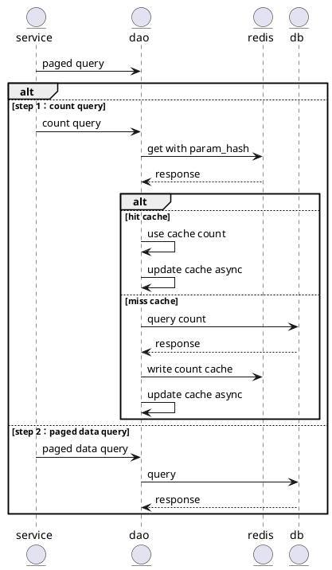

Since joining one of the most renowned technology companies in 2021, my journey has been a whirlwind of challenges and triumphs. While it's an honor to work for such a prestigious organization, I soon discovered that it came with a price. In this article, I want to share with you the up and downs of my adventure.

<!--more-->

## Preface

As the core trade system team, we are maintaining the services waiting for web requests with high QPS. Thus we have a high-standard database to store product orders submitted by our customers.

It is born with a master-slave architecture and a bunch of read-only sets (there are almost ten such instances) used to support read requests. Each instance is set with more than 20 cores and memory of more than 90GB.

Unfortunately, such a high-end configuration does not make world peace. The alarm declaring that the CPU usage of some of the MySQL instances exceed 90% emerged occasionally. But it seems that the warning duration will not last too long, so for most of the time, we took it as a sudden increase in the requests, or in another word, a normal case that is under control.

## 1 The unremitting CPU pressure alert PART ONE - with a fixed time

 I was involved when our SRE asked me for help on this issue. This alert actually came from our cloud virtual machine (yeah, not the database, but the pressure was also reflected on DB, so I put it here as a chapter). It happened from 8:40 am to 9:30 am regularly.

This is apparently an increase in the whole request served by our service during that period. So I opened our log system (backed by ELK) to search requests that came during that time period. I found that most of them were applied to the same API and the source was a team not far away from us (both logically and geographcally) - the billing team. This made me quite happy, as I've found the key I think.

I told them the situation and I got to know that time is quite a important period for their business, what they were doing is to make the daily bill of post-pay products (which means pay the money regularly, like per hour) to customers, and the large amount requests were to query product resource creator. For example, if the customer own 1000 cloud virtual machines, and the resources were charged hourly, there would be 1000*24=24k daily requests which led to high pressure on our system.

They also said a refactor on their system would publish soon and suggested that I should wait for the decline in requests. But it was proved to be not true, the day one week later, our CVMs still suffered from their new logic.

So again, I made a discussion with the developers. We looked deep into their source code and found there was actually a cache mechanism for the relationship between the product resource and the creator, but with one prerequisite that our query API responded with valid data. And if it worked as designed, one customer with 1000 CVMs would only trigger 1k requests in their whole lifecycle since the information will be reused in all their hour bills. The broken part turned out to be that some resources (and a large part of them), were not created through our trade system, so we did not have the information the billing logic was looking for. The solution became clear that the billing team need also cache this edge case - resource without a specific creator.

And after they did that, the world was back to peace, but not for a long time.

## 2 The unremitting CPU pressure alert PART TWO - with a random time

We were still suffering from the database CPU pressure alert which was triggered randomly. Time flew and the alarms continued. One day our SRE reached out to me and made a request to dig into that problem. I've been interested in this phenomenon for quite a long time, so I decided to give it a try.

As the SRE suggested, I looked into the database performance analysis system (this helped me a lot, a great database monitor system is a sharp knife) and gave a detailed look to all the slow queries. I found that the most severe queries to the database were in same format. It was doing paged query for orders created in a timescope which was very long and there were also issues in the conditions (which was produced by the api parameters, yes we have quite a open query interface which may lead to bad SQL). I searched the condition parameters in log system and confirmed that all these kind of SQL could be traced back to, again one specific source (and more specificlly, all the requests were coming from only one machine). I was happy again, as I thought I could easily guide related developers to improve their query parameters.

But it turned out that I was naive again since the maintainer (I searched out in a system) told me that he was transfered to another team and no longer in charge of that machine, nor the system running on it. Things got more embarassing when the team using that machine told me they were just user, and non of their developers were familiar with that legacy service.

The origin developer (working on another team currently) became the last hope for me. Though he was not that willing to, he still picked up all the memory and proved that the requests were triggered by scheduled tasks in the legacy system. We called out to many downstream teams to make sure that the data produced by the scheduled task was no longer meaningful to them. And after that, the colleague closed the legacy service wholely. Thumb up for all the efforts he contributed as the result was amazing, our database instances jumped down their daily CPU pressure to 3%-5% from 50%, and the alert did not emerge anymore.

The world was back to peace again, and we finally could enjoy the leisure life that the database with super-high configuration should bring to us.


## 3 The mettle to kill slow query in an early stage

But what if another system did the same mistake again? Since our API was already published and such kind of bad SQL could be reproduced by requests of other teams. We need a mechanism to prevent our database from crashing due to a slew of slow queries. To achieve this, our team built a scheduled task to check existing slow queries, and if the count of slow queries and the lines scanned exceed the threshold, the task will kill that query SQL automatically. 

We did have some conflicting thoughts on this feature as some might worry it had a bad impact on normal business logic. But the standard is quite high, that only query SQL which is slow enough and lines scanned are big enough will be evicted, we had the confidence that the strategy is a reliable guard for our database.

The scheduled task also sends a notification to us when automatic killing happens or just some slow queries are found, which leads to the story of the next chapter.

## 4 The mismatch between index and query logic

The slow query monitor task did quite a good job since we got many bad SQL from its notification and again, most of them are in the same format, which is produced by the query order operation of our customers.

If you are a user of our platform, having a look at your order list is quite a normal action and you will notice that the frontend web page is listing orders in two types:

- the prepay order: which means you pay the money the time you get the resource
- the postpay order: which means you pay money for resources regularly

Things get harder when one customer's amount of orders are large. The order table in the databases only has an index combining user id and create time, which is not a proper one for the display requirements. What we actually need is a jointed index composed of user-id, create time, and pay mode (we can distinguish prepay order and postpay order only from this). The solution is quite clear, which is to add the index we need.

But in front of the core order table with size larger than 1TB, the regular

```sql
 alter tabase add index ...
```

statement will make delay between master and slave instances too long, which is not acceptable.

We finally got solutions from DBAs. The key is to stop writing binlog in current session by:

```sql
set sql_log_bin=0
```
 
and then execute the `add index` statement at every instances. As the [mysql document](https://dev.mysql.com/doc/refman/5.7/en/innodb-online-ddl-operations.html) says, the operation to crteating a secondary index permites concurrent DML operations.

We spent one hour on each instancd, and the whole process was done in one day.

## 5 The slow MySQL count operation

With proper index, it has been a quick enough operation to fetch 10 or 20 records of orders that match the conditions composing by user id, pay mode and create time. But as every paged query is accompanied with a count opeation, and it can be very slow in large table as stated in [InnoDB Restrictions and Limitations](https://dev.mysql.com/doc/refman/5.7/en/innodb-restrictions-limitations.html). We figured out two ways to solve the problem.

### Approach A：Cache Count



Advantage:

- The frondtend does not need modification and the user experience is not affected

Disadvantage:

- The slow count operations are executed in the database. It will bring pressure to the databases

### Approach B

The paged query no longer returns the real count value, but with max value 2000 instead. This can be done by change the count sql to:

```sql
select count (*)  from（select * from table where limit 2000）
```

Advantage:

- There will be no more slow count queries executed in the database

Disadvantage:

- The frontend logic need to be modified at the same time, and the user will not get a real number
