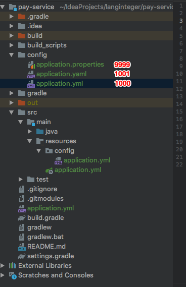
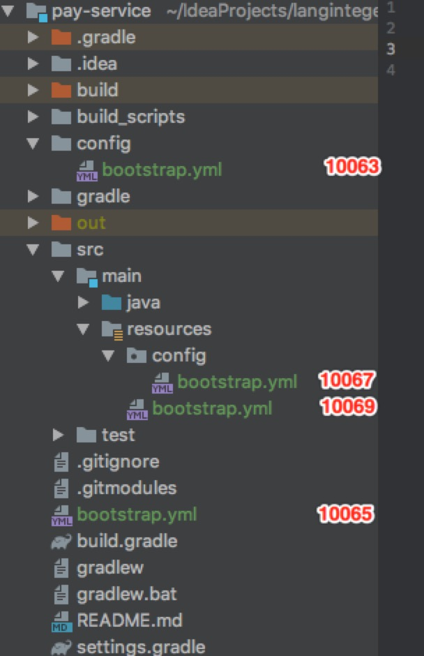
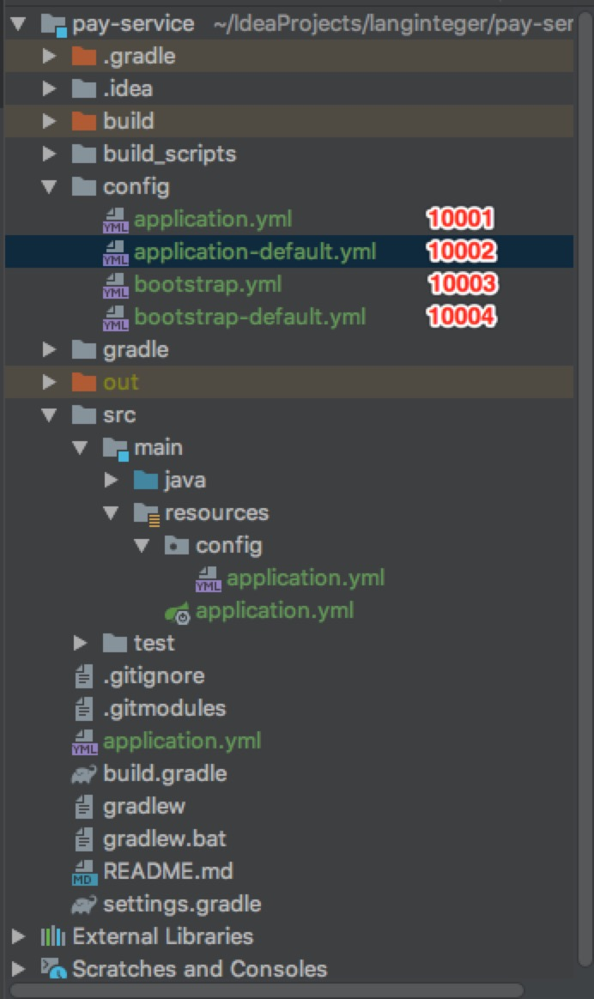
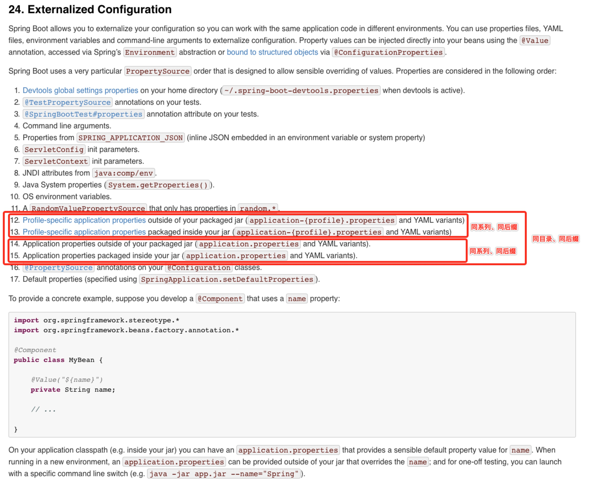
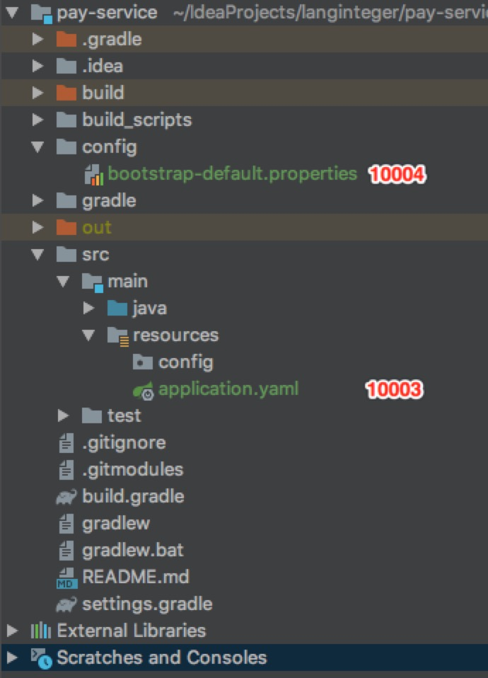
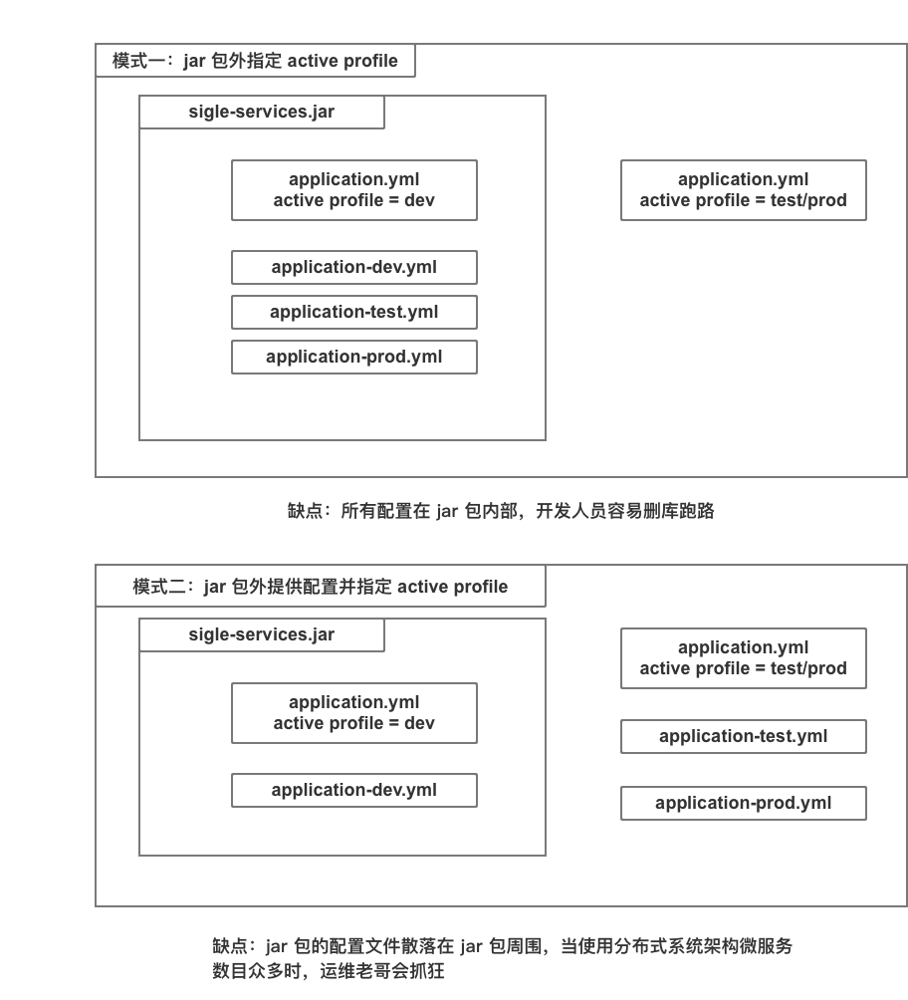
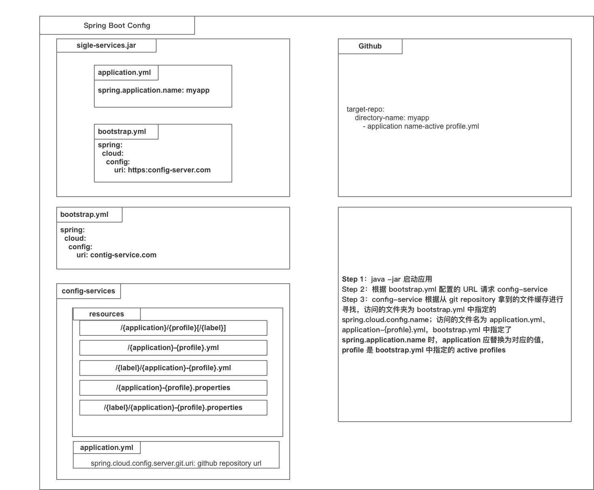

Spring Cloud 配置中心使用及各配置优先级。

<!--more-->

## 1 Spring Boot Externalized Configuration

根据之前的[实践](https://cntehang.github.io/2018/09/23/Spring-Configuration/)，Spring boot application 启动时会依次在四个路径寻找配置文件：

在：

- file:config/ 当前文件路径下的 config 目录
- file: 当前文件路径
- classpath:/config/ 类路径下的 config 目录
- classpath:/ 类路径

第一次逐目录遍历寻找寻找如下文件：

- bootstrap.properties
- bootstrap.xml
- bootstrap.yml
- bootstrap.yaml

第二次遍历寻找如下文件（未指定 active profile 时）：

- bootstrap-default.properties
- bootstrap-default.xml
- bootstrap-default.yml
- bootstrap-default.yaml

第三次遍历寻找如下文件

- application.properties
- application.xml
- application.yml
- application.yaml

第四次遍历寻找如下文件（未指定 active profile 时）

- application-default.properties
- application-default.xml
- application-default.yml
- application-default.yaml

举两个🌰

- spring boot 应用启动时加载的第一个配置文件是：file:config/bootstrap.properties
- spring boot 应用启动时加载的最后一个配置文件是：classpath:/application.yaml

条件变量有：

- 目录（file:config/、file:、classpath:/config/、classpath:/）
- 系列（bootstrap、bootstrap-{profile}、application、application-{profile}系列）
- 后缀（properties、xml、yml、yaml）
- 家族（带 bootstrap 字样为 bootstrap 家族，application 亦然）

### 1.1 同目录 的 同系列 配置文件，先加载的优先级最高。即 properties 优先级最高，yaml 优先级最低

<div align=center>

</div>

- Spring Boot 应用程序启动的端口是
- 答案：<em style="color:white">9999</em> 刮开屏幕左侧区域

### 1.2 同系列 的 同后缀 配置文件，先加载的优先级最高。即 file:config/ 目录优先级最高，classpath:/ 目录优先级最低

<div align=center>

</div>

- Spring Boot 应用程序启动的端口是
- 答案：<em style="color:white">10063</em> 刮开屏幕左侧区域

### 1.3 同目录 的 同后缀 配置文件，后加载的优先级最高。即 application-{profile}.xxx 优先级最高，bootstrap.xxx 优先级最低

<div align=center>

</div>

- Spring Boot 应用程序启动的端口是
- 答案：<em style="color:white">10002</em> 刮开屏幕左侧区域

### 1.4 Spring Boot 的参数配置形式 - 验证前面结论



参考 [官网资料](https://docs.spring.io/spring-boot/docs/1.5.9.RELEASE/reference/htmlsingle/#boot-features-external-config)

### 1.5 一点猜想

<div align=center>

</div>

- bootstrap 家族优先级最高的选手：位于被首先扫描目录 file:config/ 下的 bootstrap-default.properties
- application 家族优先级最低的选手：位于被最后扫描目录 classpath:/ 下的 application.yaml
- Spring Boot 应用程序启动的端口是
- 答案：<em style="color:white">10003 bootstrap 家族优先级一定低于 application 家族</em> 刮开屏幕左侧区域

## 1.6 总结

- bootstrap 系列优先级一定低于 application 系列
- 所在目录越先被扫描优先级越高
- active profile 文件优先级更高

## 2 Spring Cloud Config

### 2.1 使用 Spring Boot Config 实现配置文件管理



### 2.2 使用 Spring Cloud Config 实现配置文件管理

两个特点

- Externalized 外部化，配置文件存放在 jar 包外部
- Centralized 中心化，各种服务、各种环境的配置文件都集中放置在一个地方



### 2.3 优先级问题

根据 [Spring Cloud 文档](https://cloud.spring.io/spring-cloud-static/spring-cloud-commons/2.1.1.RELEASE/single/spring-cloud-commons.html#_the_bootstrap_application_context)所述：
> By default, bootstrap properties (not bootstrap.properties but properties that are loaded during the bootstrap phase) are added with high precedence, so they cannot be overridden by local configuration.

需要区分两个概念：

- properties that are loaded during the bootstrap phase：bootstrap 阶段加载的配置
- bootstrap.properties：bootstrap.properties/yml 文件中指定的配置

### 2.4 bootstrap.yml 用处

> The bootstrap context uses a different convention for locating external configuration than the main application context. Instead of application.yml (or .properties), you can use bootstrap.yml, keeping the external configuration for bootstrap and main context nicely separate. 

一个例子：

```md
spring:
  application:
    name: foo
  cloud:
    config:
      uri: ${SPRING_CONFIG_URI:http://localhost:8888}
```

### 2.5 脑洞大开

- spring-cloud-config 配置不写在 bootstrap.yml 中
- 配置仓库中放置 bootstrap.yml 配置文件

## 3 经验总结

### 1. 同一个服务的两个实例主键生成重复

服务内部采用 SnowFlake 算法生成 ID，不同的实例需配置不同的 machineId 等作为实例的标识。发生错误时的配置情况如下：

- jar 包内部 application.yml 中配置 machineId 参数，不同实例具有相同配置
- jar 包同目录下 bootstrap.yml 中配置 machineId 参数，不同实例配不同的 machineId

我们原本期望 jar 包同目录 bootstrap.yml 中的 machineId 参数配置可以优先于 jar 包内部 application.yml 中的配置，但是根据 Spring Cloud Config 文档的说明，以及我们自己做的实验，可以看到，bootstrap.yml 在一般参数中具有低于 application.yml 的优先级，所以最终两个实例都读到了程序内部配置的 machineId，造成生成了重复 ID。

由于正式环境只会持有一份配置文件，所以无法将 machineId 放到配置中心，当时采用的解决办法是将 machineId 配置从 jar 包内部抹去，使得应用只能从 jar 包外部的 bootstrap.yml 读取 machineId。但是由于服务内部没有了 machineId，导致本地都无法启动服务。更好的做法为：在 jar 包旁新建 application.yml 配置文件并配置 machineId 参数，借助顶层目录的 application.yml 的高优先级，覆盖 jar 包内的 machineId 配置
