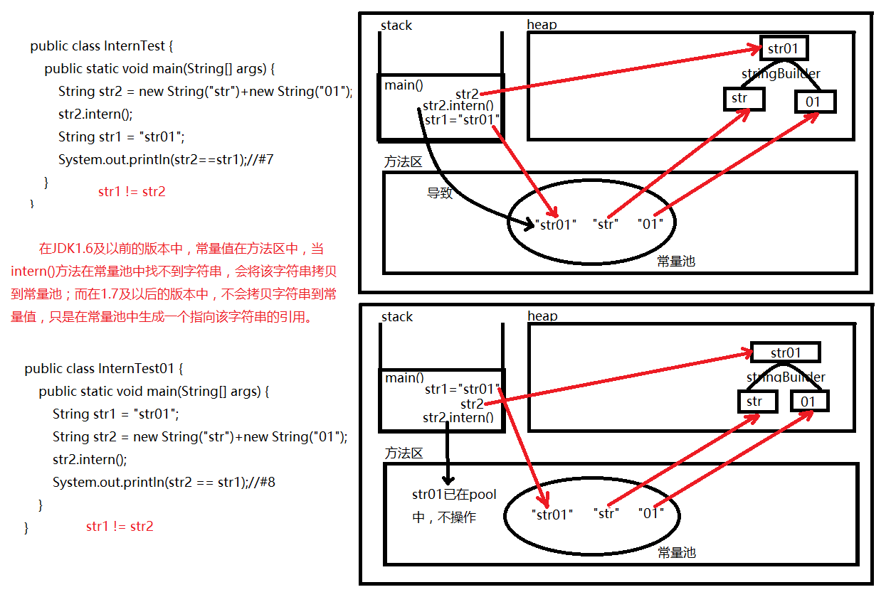
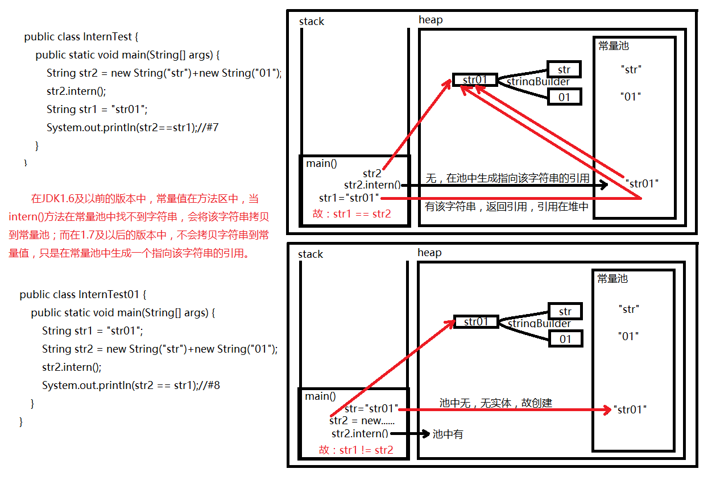

Java语言中有8种基本数据类型和一种比较特殊的数据类型String。为了使用起来更加高效（时间上和空间上），JVM为这些类型的数据分别维护了系统级别的常量池。本文主要叙述String类型的常量池以及向常量池中添加对象的intern()方法在JDK1.7以后版本中的变化。
<!--more-->

## 1. String类型常量池的维护

```java
 * Strings are constant; their values cannot be changed after they
 * are created. String buffers support mutable strings.
 * Because String objects are immutable they can be shared. 
```

String类型的对象是常量，创建之后其值便不再改变。与之对应的是String buffers支持可变字符串。String常量池的维护是以String对象的不变性作为基础的。

String常量池的维护和intern()方法密不可分，实际上，String常量池的主要使用方法只有两种：
* 保存直接使用双引号声明出来的字符串
* 对于非双引号声明的字符串对象，可使用String提供的的intern方法。它会将那些原本没有存在于常量池中的调用者对象放入常量池中。

intern()放在在JDK1.8中的描述如下：

```java
    /**
     * Returns a canonical representation for the string object.
     * <p>
     * A pool of strings, initially empty, is maintained privately by the
     * class {@code String}.
     * <p>
     * When the intern method is invoked, if the pool already contains a
     * string equal to this {@code String} object as determined by
     * the {@link #equals(Object)} method, then the string from the pool is
     * returned. Otherwise, this {@code String} object is added to the
     * pool and a reference to this {@code String} object is returned.
     * <p>
     * It follows that for any two strings {@code s} and {@code t},
     * {@code s.intern() == t.intern()} is {@code true}
     * if and only if {@code s.equals(t)} is {@code true}.
     * <p>
     * All literal strings and string-valued constant expressions are
     * interned. String literals are defined in section 3.10.5 of the
     * <cite>The Java&trade; Language Specification</cite>.
     *
     * @return  a string that has the same contents as this string, but is
     *          guaranteed to be from a pool of unique strings.
     */
     public native String intern();
```

当调用intern方法时，如果常量池中已经存在该字符串，则会返回一个常量池中该字符串的引用；如果还没有，则将当前字符串添加到常量池中并返回一个指向常量池中该字符串的引用。

在HotSpot中，常量池采用Chained hash table（应用拉链法解决冲突的散列表）来维护String常量池。在JDK1.7之前的版本中，此散列表的长度不可变且默认为1009，当放进常量池的String非常多时，散列表的冲突会很严重，从而导致链表很长，当调用intern方法时性能会大幅下降。因此很多规范中禁止使用String.intern方法，转而采用手动管理的WeakHashMap来代替，如下代码展示了Java系统级常量池的替代品：

```java
private static final WeakHashMap<String, WeakReference<String>> s_manualCache = 
            new WeakHashMap<String, WeakReference<String>>(100000);
    
    private static String manual_Intern(final String str) {
        final WeakReference<String> cached = s_manualCache.get(str);
        if(cached != null) {
            final String value = cached.get();
            if(value != null) {
                return value;
            }
        }
        
        s_manualCache.put(str, new WeakReference<String>(str));
        return str;
    }
```

JDK1.7将String常量池散列表的大小修正为可配置的，且Java7u40将其默认大小增加为60013。增加此表大小可以增强常量池在字符串查询等操作中的表现，但是每增加一个字符串常量池存储入口（即散列表大小+1），常量池的大小就会增加16 bytes（32位系统中为8bytes）。

## 2. JDK1.7版本String常量池以及intern()方法的改进

JDK1.7以前版本常量池最大的问题是它位于永久代（the PernGen），而永久代的大小在程序运行时是固定的。永久代默认大小随平台不同在32M和96M间变动，程序员可以使用-XX:MaxPermSize=N来增加其大小，但是仍无法改变其大小在程序运行期间被固定的事实。所以使用String.intern()方法需要百倍的小心，这也是为什么Java6时期常量池通常由手动管理的散列表（manually managed maps）来实现。

JDK 1.7后，HotSpot 将常量池从永久代（PermGen space，即方法区，因为存储不会轻易改变的内容而得名永久代，是HotSpot中对方法区的实现）移到了元空间（Metaspace，元空间的本质和永久代类似，都是对JVM规范中方法区的实现。不过元空间与永久代之间最大的区别在于：元空间并不在虚拟机中，而是使用本地内存）,字符串常量池不再被一个独立且大小固定的内存空间限制，而可以使用整个程序的内存空间。正因为如此，JDK 1.7 后的intern方法在实现上发生了比较大的改变，JDK 1.7后，intern方法还是会先去查询常量池中是否已经存在，如果存在，则返回常量池中的引用，这一点与之前没有区别，区别在于，如果在常量池找不到对应的字符串，则不会再将字符串拷贝到常量池，而只是在常量池中生成一个对原字符串（heap中）的引用。

由此可以引出一道非常有意思的题目：

```java
//代码段一：
public class InternTest {
    public static void main(String[] args) {
        String str2 = new String("str")+new String("01");
        str2.intern();
        String str1 = "str01";
        System.out.println(str2==str1);//#7
    }
}
//代码段二：
public class InternTest01 {
    public static void main(String[] args) {
        String str1 = "str01";
        String str2 = new String("str")+new String("01");
        str2.intern();
        System.out.println(str2 == str1);//#8
    }
}

```

代码段二在JDK1.6和JDK1.7下都会得到false结果；代码段一在JDK1.6中得到false，但在JDK1.7及以后版本中会得到true。具体的原因在代码段前已经给出了详尽的描述，下面两幅图作为补充说明：




## 参考资料：
* [深入解析String#intern](https://tech.meituan.com/in_depth_understanding_string_intern.html)
* [Understanding String Table Size in HotSpot](http://xmlandmore.blogspot.com/2013/05/understanding-string-table-size-in.html)
* [JDK7里的String.intern的变化](http://hellojava.info/?p=61)
* [String.intern in Java 6, 7 and 8 – string pooling](http://java-performance.info/string-intern-in-java-6-7-8/)
