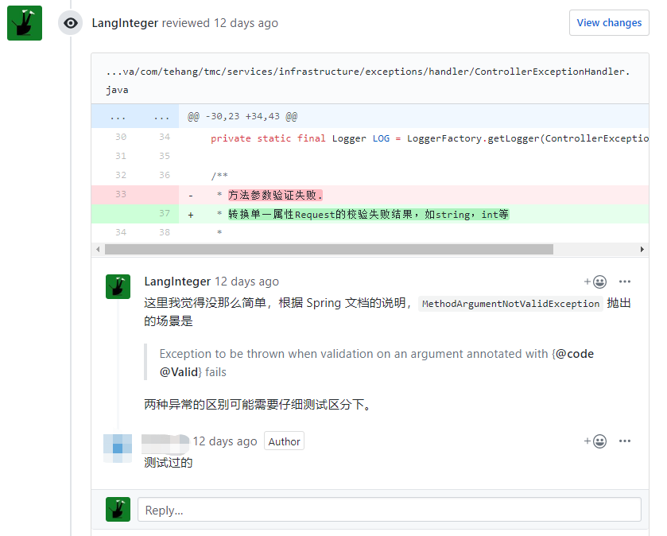
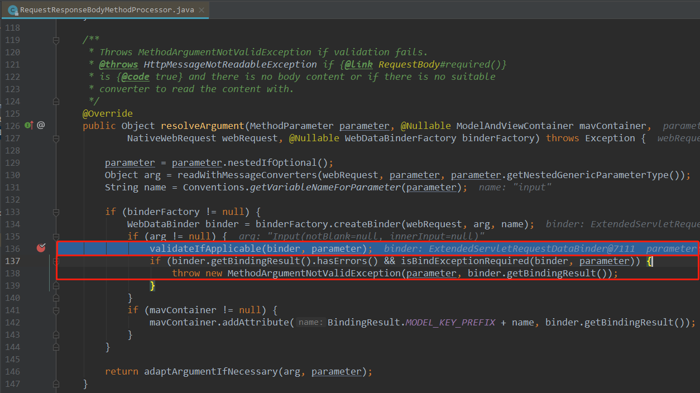
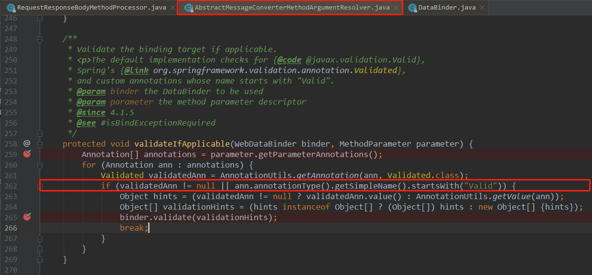
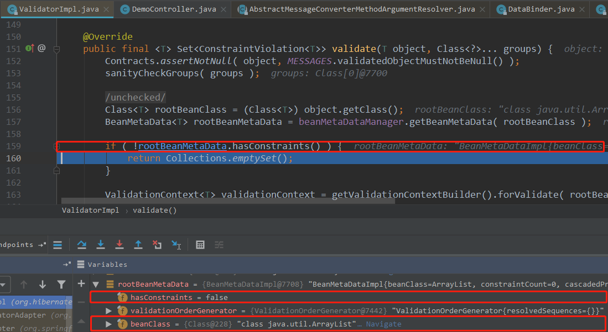
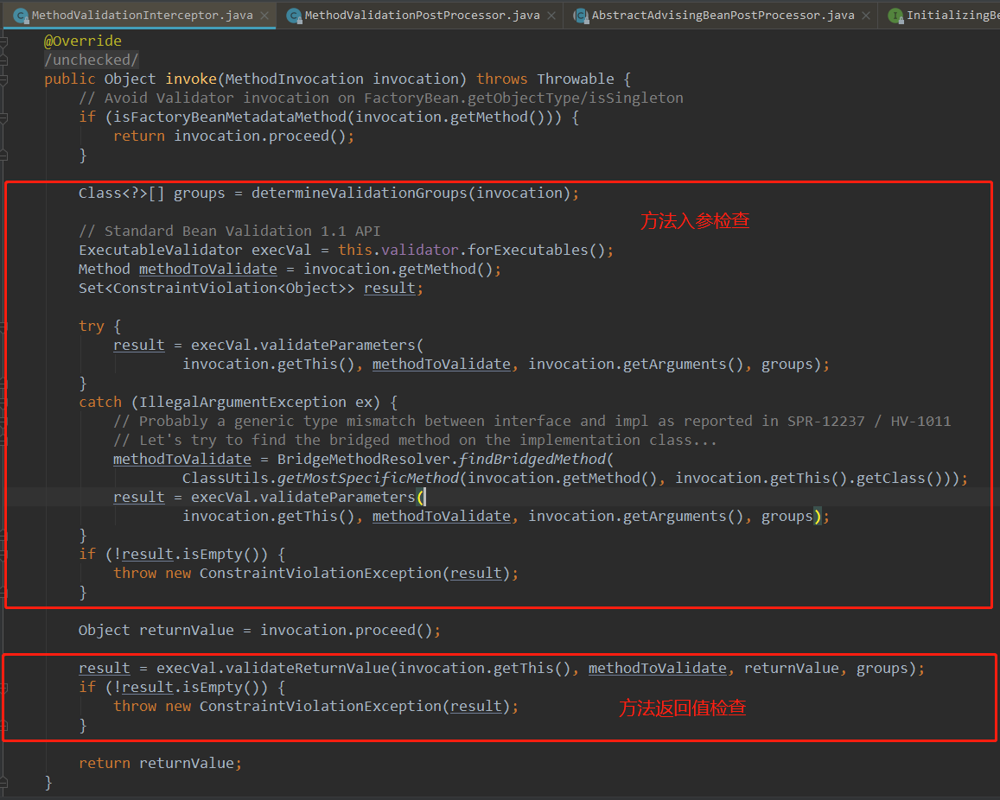
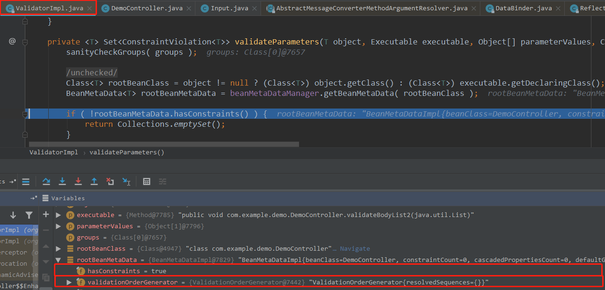

- 1 ConstraintViolationException 和 MethodArgumentNotValidException 在参数校验中有何区别？
- 2 @Valid 和 @Validated 有什么区别？
- 3 为什么在 Spring Boot 项目中， 各个方法中的 `@Valid` 注解对 query 参数和 list object 旁边的参数校验注解熟视无睹？
- 4 为什么在第 3 条的基础上，只要在 Controller 上打上 `@Validated` 注解，注解中表明的约束又能焕发新生，起到相应的作用？

<!--more-->

## 1 从一次  Code Review 说起



归纳一下，上图中的马赛克同志认为

- ConstraintViolationException 是 controller 转换单一属性Request的校验失败结果，如string，int等
- MethodArgumentNotValidException 是 controller 转换对象类Request的校验失败结果

上面的过招，让我又联想起过往的岁月中对 Spring mvc Controller 参数校验不明其所以的种种，新悲旧愤涌上心头，下定决心去解决那些不为常人所熟知的问题。

## 2 Spring Boot Controller 参数校验

一个常用的 Controller 中入参校验的例子：

```java
@RestController
public class DemoController {

  @PostMapping(value = "/test")
  public void test(@RequestBody @Valid Demo demo){
    // do something
  }
}
```

只要 Demo 类的 field 字段上标注了如 `@NotBlank` 之类的注解，就会自动对其进行校验。其原理详见对 Controller 入参进行解析的代码片段：




可见在解析参数的过程中，如果发现参数旁边有 `@Validated` 注解或者有名称以 `Valid` 开头的注解（如 `@Valid`）就会经过层层转发到达 `org.hibernate.validator.internal.engine.ValidatorImpl` 类对传入的参数进行校验，若有违反约束的信息，则会抛出 `MethodArgumentNotValidException` 异常。

在使用过程中容易发现，上述流程并不能对 query 参数和 `List Object` body 参数进行校验，这是为什么呢？

- 对于 query 参数， Spring Boot 不会像上面的 `RequstResponseBodyMethodProcessor` 一样，在解析参数时对参数进行校验，就像该类的名字一样，它只为 `RequestBody` 进行解析参数服务
- 对于 `list object`，实际上对其进行了检查，代码已经执行到了 Hibernate Validator 实现类中，但是对于一个 `List Objec`，其内部的 field 并没有指定要进行的校验规则，故直接无需校验便匆匆略去。



## 3 `@Validated` on class 前来救场

经过一些尝试，上面的两种 `@Valid` 无法处理的情况，可以借助 `@Validated` 的一些特性来进行校验。

```java
@Validated
@RestController
public class DemoController {

  @PostMapping(value = "/test1")
  public void test1(@RequestBody @NotEmpty(message = "Emply list not allowed") List<Demo> demos){
    // do something
  }

  @PostMapping(value = "/test2")
  public void test2(@RequestParam @NotBlank(message = "Blank id now allowed") String id) {
    // do nothing
  }
}
```

在 [Spring Boot 文档](https://docs.spring.io/spring-boot/docs/current/reference/html/boot-features-validation.html) 中有提到类似的例子，并给它取了一个专业的名字叫做 `method validation`。从例子中可以看出，这种特性并不只对 Controller 有效，对任意 Spring IOC 容器管理下的 bean 实例，调用其方法的时候，都会依据其方法参数（入参或出参）上的约束注解进行校验。具体实现方式如下：

最核心的 AOP 增强逻辑代码位于 `MethodValidationInterceptor` 类中（如下图）。可见其对入参出参都进行了检查，并在有规则被违反时抛出 `ConstraintViolationException`。



对 `list obbject` 又进行了校验的原因是，此处调用的不再是 `org.hibernate.validator.internal.engine.ValidatorImpl` 的 validate 方法，而是其 validateParameters 方法，他们对 `list object` 的处理不一。很明显，validateParameters 方法认真对待了 `list object` 中元素中定义的约束注解。



## 4 结论

### 4.1 @Valid vs @Validated

两个注解的所属包、注释及定义分别为，会发现 Valid 相较于 Validated 能够额外打在 `Field` 上

- javax.validation.Valid
  - Marks a property, method parameter or method return type for validation cascading.
  - @Target({ METHOD, FIELD, CONSTRUCTOR, PARAMETER, TYPE_USE })
- org.springframework.validation.annotation.Validated
  - Variant of JSR-303's `javax.validation.Valid`, supporting the specification of validation groups. Designed for convenient use with Spring's JSR-303 support but not JSR-303 specific.
  - @Target({ElementType.TYPE, ElementType.METHOD, ElementType.PARAMETER})

@Validated 是 spring 针对 JSR303 规范的一个扩展，增加了诸如对分组校验等功能的支持。同时还有一点需要注意，@Valid 可以打在 Field 上，而 @Validated 是不可以的，这使得 @Valid 成为嵌套校验（Object 内部包含需要校验的另一个 Object）时的唯一选择。

### 4.2 ConstraintViolationException vs MethodArgumentNotValidException

两个异常类所属包及其类的注释分别为

- javax.validation.ConstraintViolationException
  - Reports the result of constraint violations
- org.springframework.web.bind.MethodArgumentNotValidException
  - Exception to be thrown when validation on an argument annotated with @Valid fails.

根据上文分析，ConstraintViolationException 是违反了 spring method valition 检测到校验失败时抛出的异常，而 MethodArgumentNotValidException 则是违反了 spring boot controller resquest body 参数校验规则时抛出的异常。

## 4.3 如何统一处理两种异常

`Bean Validation` 规范中如果有内容违反了相关的约束注解（如 @NotNull），那么应该抛出的是 `javax.validation.ConstraintViolationException`。但是为了区分出一般的校验和 controller 层参数校验的区别，Spring MVC 对参数校验加了一些料，在转换入参的过程中按如下步骤进行组织了整个参数解析和校验的流程：

- RequestResponseBodyMethodProcessor
  - Resolves method arguments annotated with `@RequestBody` and handles return values from methods annotated with `@ResponseBody` by reading and writing to the body of the request or response with an `HttpMessageConverter`.
  - An `@RequestBody` method argument is also validated if it is annotated with `@javax.validation.Valid`.
- DefaultHandlerExceptionResolver
  - 处理 MethodArgumentNotValidException，返回 `HttpStatus` 为 400 的结果

而 ConstraintViolationException 则会抛出 500 的结果。这两种都不是我们服务当前基础假设下应返回的结果。只要 HTTP 请求正确到达了 Controller，返回的 HTTP CODE 为 200 即可，至于上述两种参数不正确的情形，应该在 HTTP RESPONSE BODY 的 json 串中返回 code = 97。

## 5 Reference

- [Method Validation With Spring 3.1 and Hibernate Validator 4.2](https://blog.codeleak.pl/2012/03/how-to-method-level-validation-in.html)
- [Method Constraints with Bean Validation 2.0](baeldung.com/javax-validation-method-constraints)
