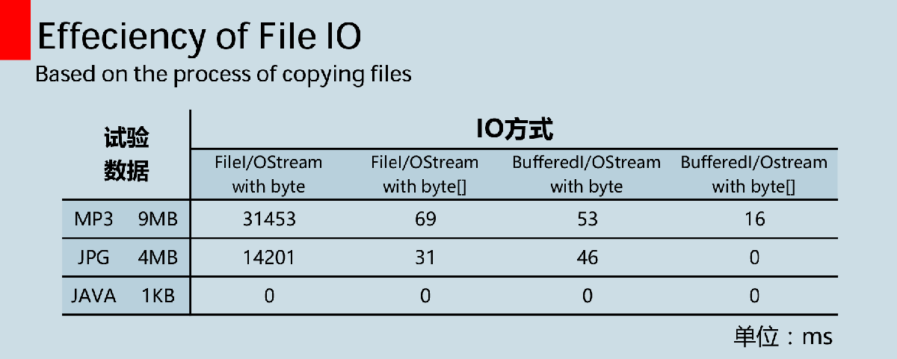

I/O是一个庞大复杂的系统，既要考虑到各种I/O源端和各种想要与之通信的接收端（文件、控制台、网络链接等），而且还要考虑和他们通信的不同方式（顺序、随机存取、缓冲、二进制、按字符、按行、按字等）。
下面的内容记录了Java IO中对文件的典型操作。
<!--MORE-->

## 1. 文件的查找-FilenameFilter过滤器
当使用FIle对象的list方法或者listFiles方法时，我们往往希望能够通过某种过滤器使得展示的列表符合我们的某种期望。FilenameFilter正是基于这种需求而产生。

下面的这段代码将E盘根目录下以.mkv结尾的文件在控制台打印出。

```java
public static void main(String[] args) {
        File file1 = new File("E:\\");

        System.out.println(Arrays.toString(file1.list(new FilenameFilter() {
            @Override
            public boolean accept(File dir, String name) {
                return name.endsWith(".mkv");
            }
        })));
    }
```

创建FilenameFilter子类对象的意义在于将accept()方法提供给list()使用，使得list()可以回调accept()，进而以决定哪些文件可以包含在列表中。list()方法会为此目录下的每个文件名调用accept()，来判断该文件是否包含在内。

## 2. 文件目录的删除
当文件为多层目录结构时，其删除需要递归进行，见如下代码（方法一保留最上层文件夹，方法二则完全删除）：

```java
    private static boolean deleteDeepFileWithOrigin(File file) {

        File[] menu = file.listFiles();

        for(File f : menu) {
            if (f.isFile()){
                f.delete();
            } else if (f.isDirectory()) {
                deleteDeepFile(f);
                f.delete();
            }
        }

        return file.delete();
    }

    private static boolean deleteDeepFile(File file) {

        File[] menu = file.listFiles();

        for(File f : menu) {
            if (f.isFile()){
                f.delete();
            } else if (f.isDirectory()) {
                deleteDeepFile(f);
                f.delete();
            }
        }
        return true;
    }
```

## 3. 文件的复制
文件复制涉及将文件以流的方式从外设读入内存，再输出到外设的过程。

### 3.1 按字节流的方式复制
Java IO类（字节处理）可以做如下划分（部分）：
* InputStream
	* FileInputStream：从文件读取信息
	* FilterInputStream：输入装饰器类接口
		* BufferedInpuStream：带缓冲区的写入流
* OutputStream
	* FileOutputStream：将信息写至文件
	* FilterOutputStream：输出装饰器类接口
		* BufferedOutputStream：带缓冲区的输出流
		* PrintStream：用于产生格式化输出，代表为System.out

按字节流操作，所有与输入有关的类都从InputStream继承，所有与输出有关的类都从OutputStream继承，故它们都分别包含read()和write()基本方法，用来处理单个字节或字节数组。处理字节流的类方法参数一般关联int(取低8位)和byte[]。

FileI/OStream初始化参数为文件，而BufferedI/OStream则是在FileI/OStream基础上的包装，最大程度实现了代码复用，是包装设计模式的代表，故BufferedI/OStream对象的初始化参数为InputStream(一般代指FileI/OStream)。需要注意的是，Buffer类含有缓冲区，需要合理搭配flush方法实现及时的I/O操作。

同等条件下，对字节数组进行处理比挨个处理字节要快，而使用BufferdI/OStream比FileI/OStream要快，其中的原因在于快的方法都通过缓存减少了和OS直接打交道的次数，则文件复制中最快的方式是采用BufferedI/OStream操作字节数组，下面的图表展示了在windows环境下采用不同方法进行文件复制花费的时间情况。



下面的代码段采用FileI/OStream操作Byte[]对磁盘中的文件进行复制，需要注意：
* 当初始化输出流的参数文件不存在时，JVM会主动创建该文件（如果缺失目录则会返回异常）；
* read(byte[] bytes)方法会返回读取到的字节数，当读完时会返回-1，故配合write(byte[], off, len)能够做到读多少写多少；
* 流资源的回收用close()方法，但是流可能本身为空，故需要先判空，不然可能会产生NullPointerException；
* 回收资源的时候，由于BufferedI/OStream是对FileI/OStream的包装，故只需在Buffer层次上关闭一次即可。

```java
    public static void main(String[] args) {

        String startFile = "E:\\[84].天堂电影院.Cinema.Paradiso.1989.BDRip.x264.2Audio.AAC.miniSD-TLF.mkv";
        String desFile = "C:\\movie\\[84].天堂电影院.Cinema.Paradiso.1989.BDRip.x264.2Audio.AAC.miniSD-TLF.mkv";

        File star = new File(startFile);
        File des = new File(desFile);

        try {
            copyFile(star, des);
        } catch (FileNotFoundException e) {
            e.printStackTrace();
        } catch (IOException e) {
            e.printStackTrace();
        }
    }

    private static void copyFile(File start, File des) throws IOException {

        BufferInputStream fis = new BufferInputStream(new FileInputStream(start));
        BufferOutputStream fos = new BufferOutputStream(new FileOutputStream(des));
        byte[] buff = new byte[1024];
        int len = -1;

        while((len = fis.read(buff)) != -1) {
            fos.write(buff, 0, len);
        }

        closeQuietly(fis);
        closeQuietly(fos);
    }

    private static void closeQuietly(Closeable stream) {
        
        try {
            if (stream != null) {
                stream.close(); 
            }
        } catch (IOException e) {
            e.printStackTrace(); 
        }
        
    }
```

### 3.2 字符流的方式复制

Java IO类（字符处理）可以做如下划分：
* Reader
	* InputStreamReader：adapter类，输入转换流
		* FileReader：父类的简化
	* BufferedReader：带缓冲区
* Writer
	* OutputStreamWriter：adapter类，输出转换流
		* FileWriter：父类的简化
	* BufferedWriter：带缓冲区
	* PrintWriter：产生格式化输出

Reader/Writer是JDK1.1引入的，但是并不是用于代替InputStream/OutputStream，这两个新类是为Java提供兼容Unicldee的面向字符I/O功能，以方便国际化，而老的I/O流仅支持8位字节流。

字符流在底层也是基于字节流的，InputStreamReader和OutputStreamWriter分别用InputStream和OutputStream初始化。

采用字符流对文件进行复制的方式与采用字节流方式的代码基本无异，但是需要注意的是：
* 字符流方式不能用来传输多媒体文件。
* 字符流自带缓冲区。OutputStreamWriter的功能是以**组合**的代码复用方式通过其所含的StreamEncoder变量实现的，而StreamEncoder类中含有一个int类型的DEFAULT_BYTE_BUFFER_SIZE变量用来标记缓冲区大小。
* OutputStreamWriter(也即StreamEncoder)的缓冲区大小为8k大小的byte[]，而BufferedWriter的缓冲区大小为8k的char[]。
