<div align=center>

</div>

- 本文分析基于 JDK 11
- Picture from [iOS Tech Set
](https://medium.com/@iostechset/3-ways-to-detect-memory-leaks-in-ios-bdf9425507d6)

<!--more-->

## 1 问题初现

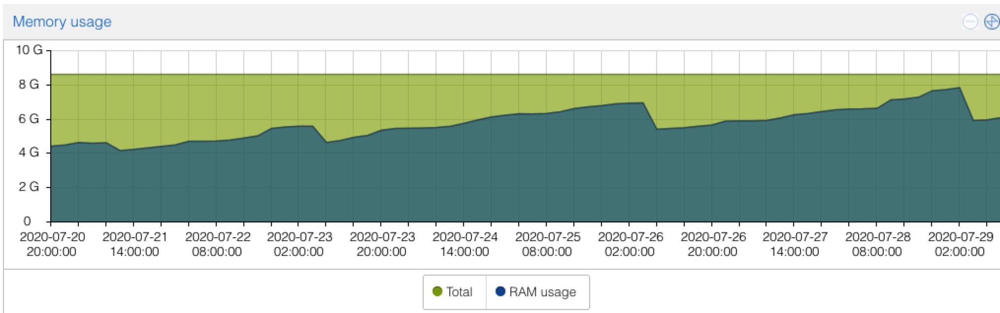

某服务上线后，服务器内存使用呈现出不断上扬的趋势（突然的降低是因为发版重启），怀疑服务存在内存泄漏问题。

## 2 迷雾重重

使用 free -h 命令查看服务器内存使用情况：


经过一段时间观察，发现此 Linux 服务器的 buff/cache 部分占用内存巨大，而且一直在增加，从几百 MB 最终增加到了 4.1GB。在查询相关资料的过程中，发现了一个有意思的网站 [Linux ate my ram](https://www.linuxatemyram.com/)。

根据网站唯一的一篇文章所述， buff/cache 是 Linux 操作系统为优化程序使用速度而做的 Disk Cache 占用到的内存部分。这部分“被使用”的内存并不是真正被使用了，在用户程序需要内存时候，buff/cache 占用的内存会被及时释放掉。所以评估一台服务器的可用内存的时候，使用 free + buff/cache 来看是更为合适的。

查到这里，初步认为服务器内存占用上扬是因为 buff/cache 占用过大，且统计内存使用口径不是很科学造成的。

## 3 正视问题

服务器内存占用比例一直在上涨，虽然有 buff/cache 使用情况撑腰，但是始终还是放心不下。同时使用 top then shift + m 命令查看服务器进程的内存占用排序。

服务启动不久：
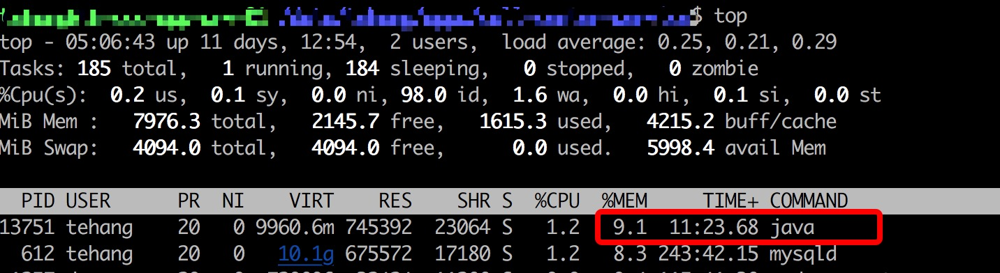

两三天之后：
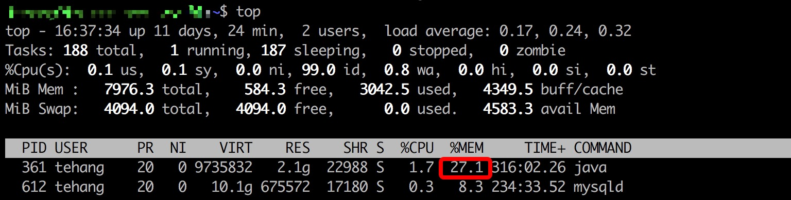

可以看到，服务器上部署的 java 程序进程占用内存比例增长迅速（相比之下，mysql 进程内存占用一直维持在 8% 左右）。初步判断该服务确实存在内存泄漏问题。

## 4 问题分析

要分析是否存在内存泄漏问题，需要分析该 java 进程的堆内存使用情况，GC 情况。

要分析内存泄漏问题的成因，需要分析该 java 进程的堆内存的老年代空间占比大对象的成因，继而避免这些对象无法被回收，从而解决内存溢出问题。

### 4.1 查看堆情况

使用命令查看进程堆内存使用情况：

- jhsdb jmap --pid your-java-service-pid --heap

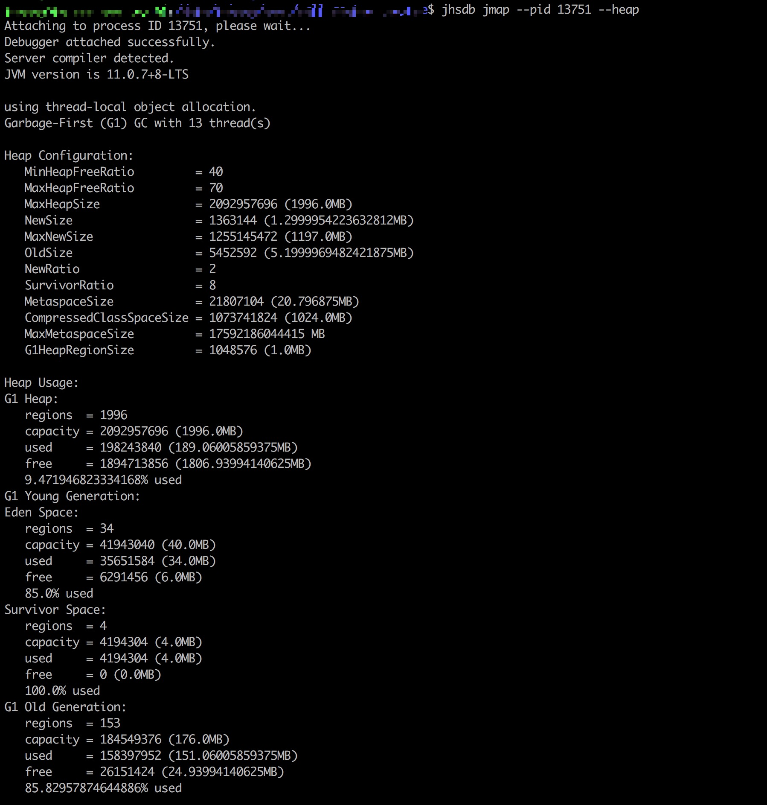

这个命令只能反映当前堆内存情况，用来查看堆大小、代分配是否合理还行，更多的信息则无法很直观的看出来。

### 4.2 查看 GC 情况

使用命令查看进程 GC 情况：

- jstat -gcutil your-java-service-pid 1000 100

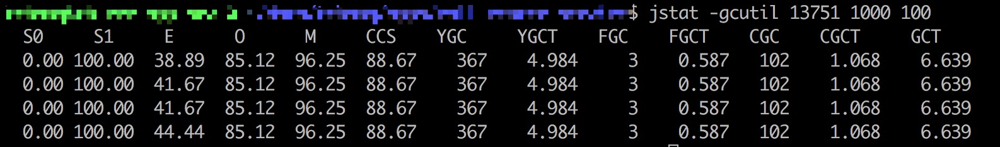

这个命令可以查看进程启动以来 Young GC / Full GC 的次数及时间，并且会间隔很短展示最新数据，主要用于判断系统 GC 频率是否有问题，GC 时间是否过长影响系统正常运行等。

### 4.3 查看 GC 历史

要查看GC历史，需要打印GC日志，应用启动命令类似如下：

```text
nohup java -XX:+PrintGCDetails \
  -Xloggc:log/gc.log \
  -XX:+HeapDumpOnOutOfMemoryError \
  -XX:HeapDumpPath=log/dump.log \
      -jar ${linkname} > nohup.out 2>&1 &
```

查看服务运行两三天后的GC日志，过滤出其中 Full GC 的信息

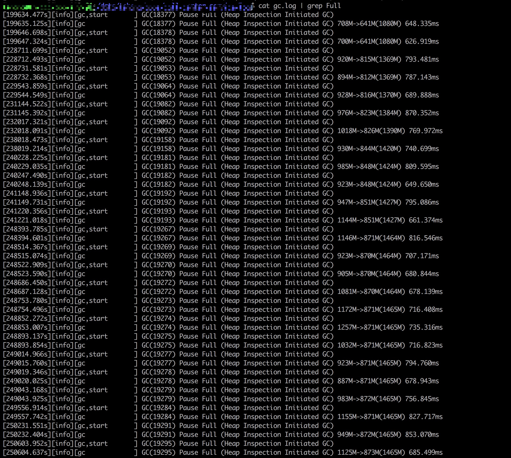

可以观察到，经过多次 Full GC，箭头右边的反映 GC 后老年代堆内存大小的数值在增加。这说明有老年对象一直没有被释放，某个对象对这些对象的引用一直维持着。这种趋势下去，OutOfMemory 错误的出现不可避免，完全实锤了该服务的内存泄漏问题。

### 4.4 查看堆实例对象分布

查看进程堆中当前实例数前 20 类排名：

- jmap -histo:live your-java-service-pid | head -n 20

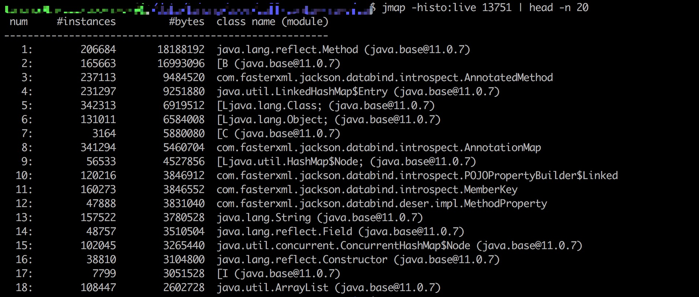

查看进程堆中当前实例数前 20 且为该项目包路径下类排名：

- jmap -histo:live your-java-service-pid | grep your-project-package-typical-word | head -n 20

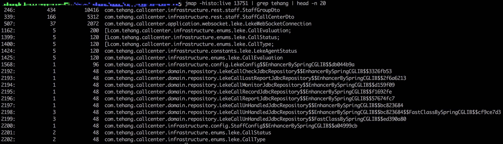

这里笔者犯了一个严重错误，认为只有项目包路径下的对象个数异常才说明有内存泄漏，但是忽略了写一个项目本身就使用了很多第三方类库的事实，所以上述两个查询中展示的对象都可以用于排查内存泄漏问题。

从查询一可以看出，堆内存中 HashMap$Node 这一 HashMap 的静态内部类实例数量非常多，引起了笔者同事的怀疑。查遍项目代码中，并没有直接使用 HashMap 的地方，笔者同事再显神威，指出项目中使用的 LinkedMultiValueMap 内部正是套了一个 HashMap 来实现的。

### 4.5 问题重现

由于生产服务器 JVM 不好连接调试，一大把分析工具无法用上。既然已经锁定了问题代码所在的问题，那就干脆写个测试用例反复调用该方法，并在此过程中分析进程堆内存中 HashMap$Node 对象的变化趋势及源头。

使用的工具是 JDK 自带的 jvisualvm（jdk11 中移除了，jdk8中有） 和 [jprofiler](https://www.ej-technologies.com/products/jprofiler/overview.html)。jprofiler 有个很好的功能是查看谁引用着堆中未释放的对象，这样就可以追根溯源找到实际所写代码中有问题的部分。

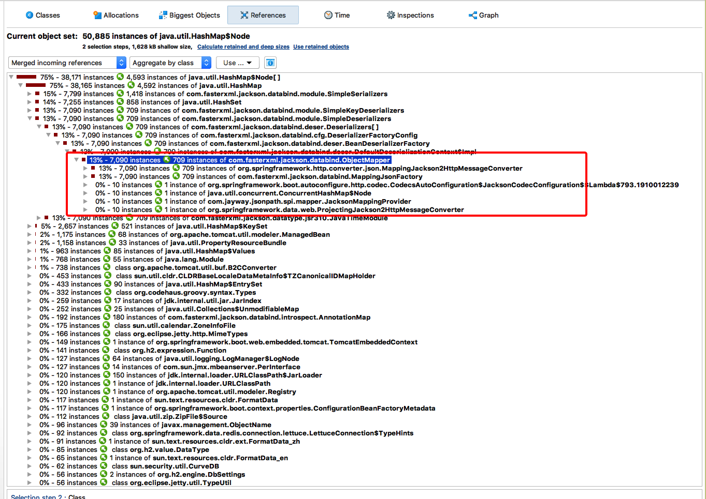

如上图所示，在所跑测试进程的堆内存快照中，HashMap 实例分成很多部分，其中 15%、14% 和一个 13% 的部分都确认最终被 MappingJackson2HttpMessageConverter 对象引用而无法被释放。看到这里，很快就发现了代码中的问题:

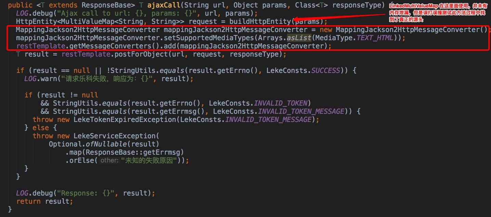

restTemplate 是一个单例对象，每次代码走到这里，都会创建出一个 MappingJackson2HttpMessageConverter 并添加到 restTemplate 单例对象的 messageConverter 组中。从而造成 MappingJackson2HttpMessageConverter 对象无法被释放。

最后还可以再在生产环境中印证一下。某操作会调用两次 ajaxCall 方法，操作前打印出 MappingJackson2HttpMessageConverter 实例数为 1205，操作后变成了 1207。真是二。

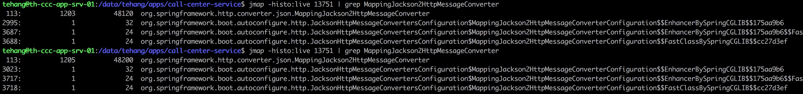

## 5 总结

本次内存泄漏事故排查：

- 有百转千回的求索，在相关经验不甚丰富的情况下，使劲儿查资料，借鉴别人的排查方法；
- 有方法论，如上所述的步骤基本可以作为排查内存泄漏问题的模版，先根据 GC 日志确定是否有内存溢出，再根据堆内存情况锁定未被回收对象；
- 有巧合的成分，疑似内存泄漏代码临近内存泄漏代码，在对该方法的测试过程中完美重现了内存溢出实景；
- 也站在巨人肩膀上，JDK 各种工具如 jmap、jstat、jvisualvm 等都为排查 java 进程运行问题提供了极大便利，一些第三方收费工具如 jprofile 则更上一层楼，让内存溢出的迷雾昭然若揭。
