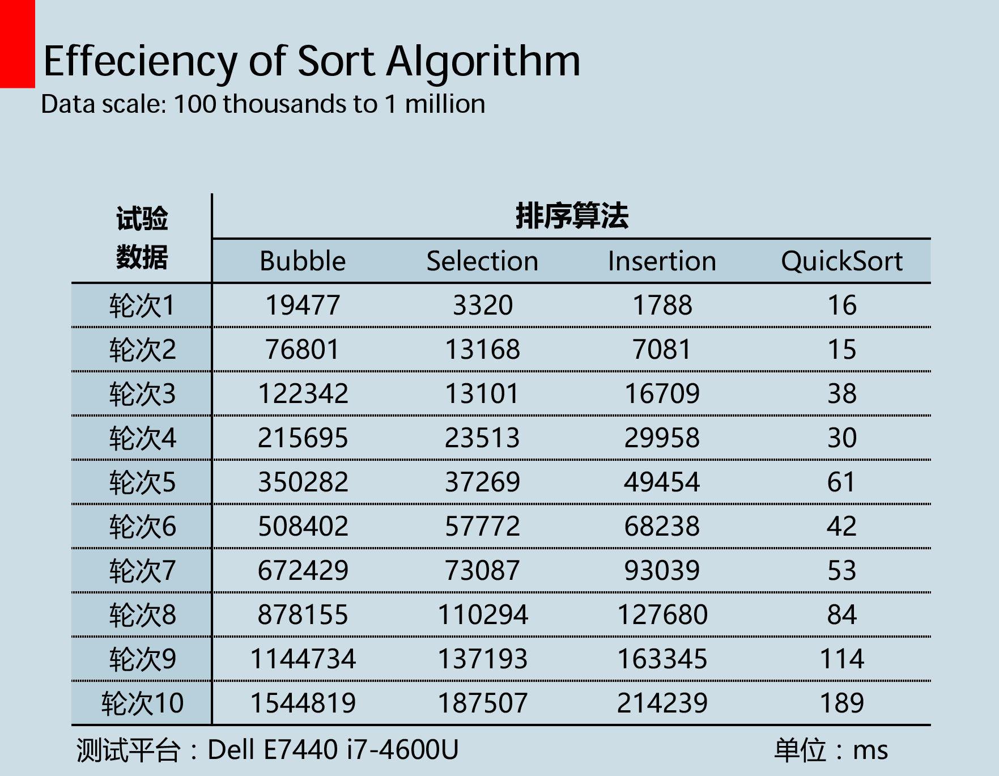
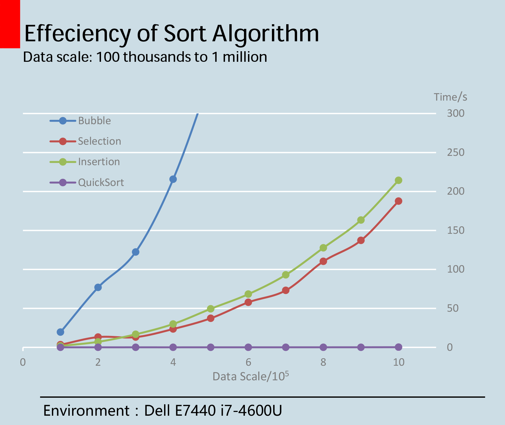

>今日用Java实现了几种排序算法，包括冒泡排序、简单选择排序、插入排序、归并排序和快速排序。前三种是我以前眼中比较low的时间复杂度为O(n^2)的算法，后面两种则是感觉各种高大上的时间复杂度为O(nlogn)的排序。写完之后手痒痒，对这几种排序进行了10万~100万数据量之间排序性能的测试，~~由于归并排序比较扯淡，不在次次测试之列~~（事实是它并不扯淡）。
<!-- more -->

* 本文分三个章节：
	* 排序算法测试分析
	* O(n^2)算法和它们的亲戚一览
	* 政治正确的快排


## 1 排序测试结果分析
这次测试中有三种O(n^2)的算法，分别为冒泡排序、简单选择排序、插入排序，和一种O(nlogn)的快排算法。四种算法在10万至100万数据量之间奋力一搏，其中尤以冒泡排序欲仙欲死（反正等得我花儿都谢了的），具体的测试数据见下表。


为了让结果更加直观，又绘了一张图（见下）。可以看到，冒泡排序扶摇直上，不坠青云之志，简单选择和插入则你追我赶，情意绵绵，只有快速排序仰望星空，却又不忘脚踏实地，


## 2 O(n^2)算法和它们的亲戚一览

`冒泡排序`是依次将相邻的两个数进行比较，经过**一趟**比较会把一个数（无序序列中的最大值或者最小值）放到序列的最终位置。冒泡排序是`稳定`的。冒泡排序的亲戚是`快速排序`，这是一种经典的基于`分治法`的算法，`快速排序`是`不稳定`的。
`简单选择排序`：对线性表L[1..n]，第i趟排序即从L[i...n]中选择关键字最小的元素与L(i)交换，每一趟排序可以确定一个元素的最终位置。`简单选择排序`是`不稳定`的，因为它很跳。简单选择排序的亲戚是`堆排序`，它将顺序表看成是完全二叉树的顺序存储结构，借用完全二叉树中父节点和子节点的关系，在无序区中找到关键字最大（或最小）的元素。`堆排序`也是`不稳定`的。
`直接插入排序`：每次将一个待排序的元素，按其关键字大小插入前面已经有序的子序列中，`直接插入`排序是稳定的，其插入的过程可以通过`二分查找`进行优化。直接插入排序的亲戚是`希尔排序`，又称为缩小增量排序，它先对原序列的子序列进行直接插入排序，完成后整个序列基本有序，再对全体记录进行一次直接插入排序。`希尔排序`时间复杂度不确定且`不稳定`。

## 3 政治正确的快排
经过本次测试，让我更加坚定了快速排序一百年不动摇的大政方针，坚决拥护以快排为中心的排序中央，胸前的红领巾更加鲜艳了。
代码如下：

```java
public static void qSort(int[] target) {
    qSort(target, 0, target.length - 1);
}

private static void qSort(int[] target, int start, int end) {

    if (start < end) {
        int pivotPositon = partion(target, start, end);
        qSort(target, start, pivotPositon - 1);
        qSort(target, pivotPositon + 1, end);
    }
}

private static int partion(int[] target, int start, int end) {
    int pivot = target[start];
    while(start < end) {
        while (start < end && target[end] >= pivot)
            end--;
        target[start] = target[end];

        while (start < end && target[start] <= pivot)
            start++;
        target[end] = target[start];
    }
    target[start] = pivot;
    return start;
}
```