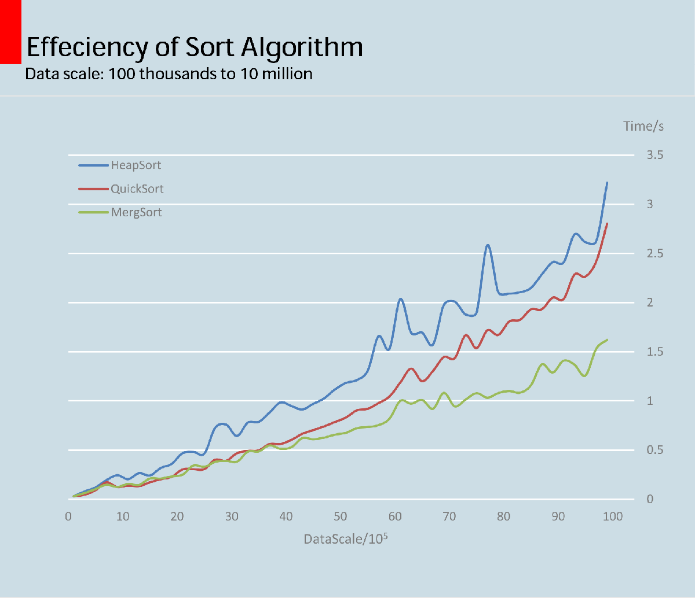

>继昨天快排吊打一干O(n^2)的排序算法之后，新的风暴已经出现。堆排序、快速排序、归并排序三个大手子开始决战紫禁之巅，在10w-1000w数据排序的比拼中一探高下。
<!--more -->

## 1 封神榜
不得不说各位O(nlogn)大佬都很厉害的，1000w级别随机数（随机数范围[0, 10000)）的排序时间没有超过3.5s（在这台i7-4600U的弱机上）。而其中，归并排序以其独特的技法成为了最大黑马，一举战胜了堆排序和快排，勇夺第二届排序世锦赛冠军。此次测试的结果见下面的图表。

## 2 堆排思想
首先来一张堆排序动画演示图片。

堆排序是指利用**堆**这种数据结构所设计的一种排序算法。**堆积**是一个近似完全二叉树的结构，并同时满足堆积的性质：即子结点的键值或索引总是小于（或者大于）它的父结点。堆一般通过一维数组来实现,在数组起始位置为1的情形中，结点间有如下关系：
* 父结点i的左子结点在位置(2i);
* 父结点i的右子结点在位置(2i + 1);
* 子结点的父结点在位置floor((i - 1) / 2)。

堆排序原理就是把最大堆堆顶的最大数取出（放到堆所在的数组尾部），将剩余的堆继续调整为最大堆，如此反复，当堆中只剩一个数的时候结束。堆排序中定义的操作主要有：
* 下沉（Fixdown）：即根据堆的定义，对不符合条件的结点中的元素进行换位，由于是父结点元素可能被换到子结点，因此形象的称为下沉。
* 建堆（Heapify）:即从倒数第一个不是终端叶结点的结点开始，挨个进行下沉操作，注意当父结点的子结点不是终端结点的时候，可能会进行多次下沉操作，此时要用循环或者递归控制。
* 堆排序（Heap_Sort）：一般的做法是，将堆顶元素和堆底元素对换，然后对新的堆顶元素执行下沉操作，此时堆的size也随之减1。如此循环，最后将承载堆的一维数组变为一个有序的序列。

为了节约篇幅，下面的代码只给出了下沉和堆排序的操作，但是在这之前必须要先完成建堆的过程（其实他也是依赖于下沉操作）。

```java
public void heapSort() {
        for (int i = size; i > 1;) {
            swap(elements, i, 1);
            i--;
            fixDownWithRecursion(1 ,i);
        }
    }

    //采用非递归方法对index = i处的元素进行下沉操作
    private void fixDown(int index) {
        for (int i = index * 2; i < size; i *= 2) {
            int child = i;

            if(child + 1 <= size) {
                if (elements[child + 1] > elements[child])
                    child = child + 1;
            }

            if (elements[child] > elements[index]) {
                swap(elements, child, index);
                index = i;
            }
        }
    }
```

## 3 归排思想
首先还是以Wiki上的一幅图片作为说明。


归并排序是诺依曼冯大大1945年提出的，该算法是采用分治法的一个非常典型的应用。从这次测试的结果可以看出，当数据量较小的时候，快排和归并排序不相伯仲，但是当数据量超过某个限值后，归并排序的优势就逐渐显现出来了。而且归并排序思想朴素，和二分查找一样是一个绝佳的用来锻炼分治思维的模版。

算法中最重要也是最细节的部分是merg方法，就是把两个未知长度的有序数列合并成一个有序数列的过程，要注意边界的处理，至于递归部分则是很自然的想法。
```java
public static void mergSort(int[] arr) {
	int[] temp = new int[arr.length];
	mergSort(arr, 0, arr.length - 1, temp);
}

public static void mergSort(int[] arr, int start, int end, int[] temp) {
	if (start < end) {
		int mid = (start + end) / 2;
		mergSort(arr, start, mid, temp);
		mergSort(arr, mid + 1, end, temp);

		merg(arr, start, mid, end, temp);
	}
}

public static void merg(int[] arr, int start, int mid, int end, int[] temp) {
	int lStart = start;
	int lEnd = mid;
	int rStart = mid + 1;
	int rEnd = end;

	int k = start;
	while(lStart <= lEnd && rStart <= rEnd) {
		if (arr[lStart] <= arr[rStart])
			temp[k++] = arr[lStart++];
		else
			temp[k++] = arr[rStart++];
	}

	while(lStart <= lEnd)
		temp[k++] = arr[lStart++];
	while(rStart <= rEnd)
		temp[k++] = arr[rStart++];

	System.arraycopy(temp, start, arr, start, end - start + 1);
}
```