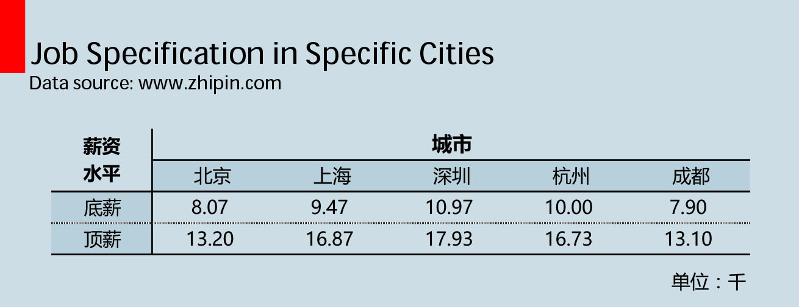
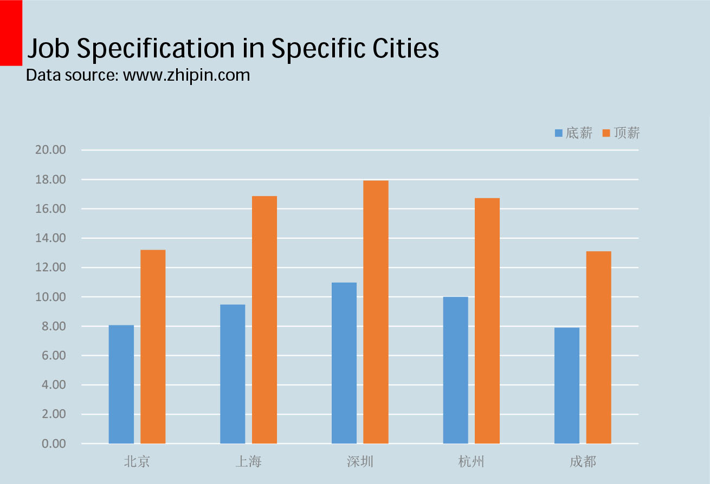
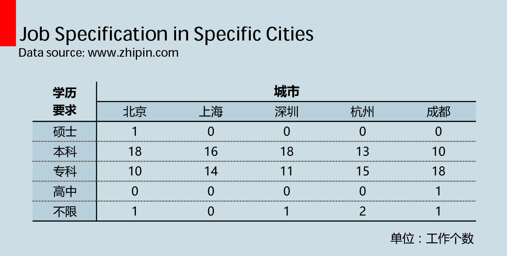
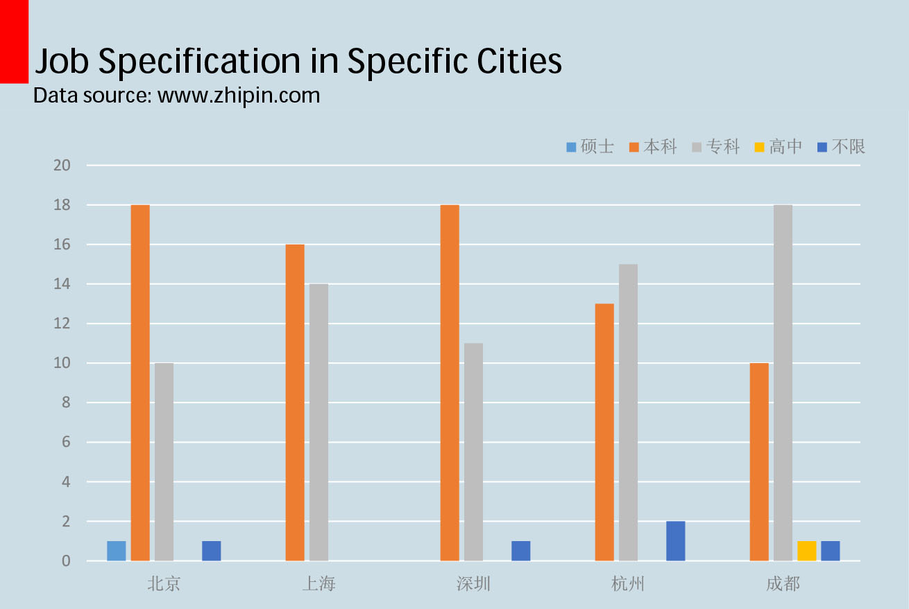
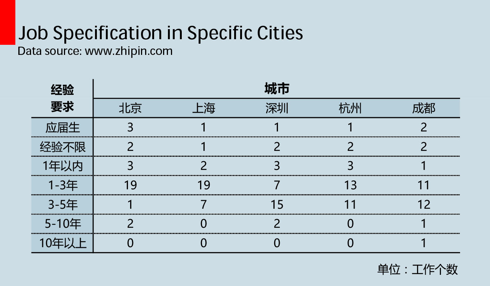
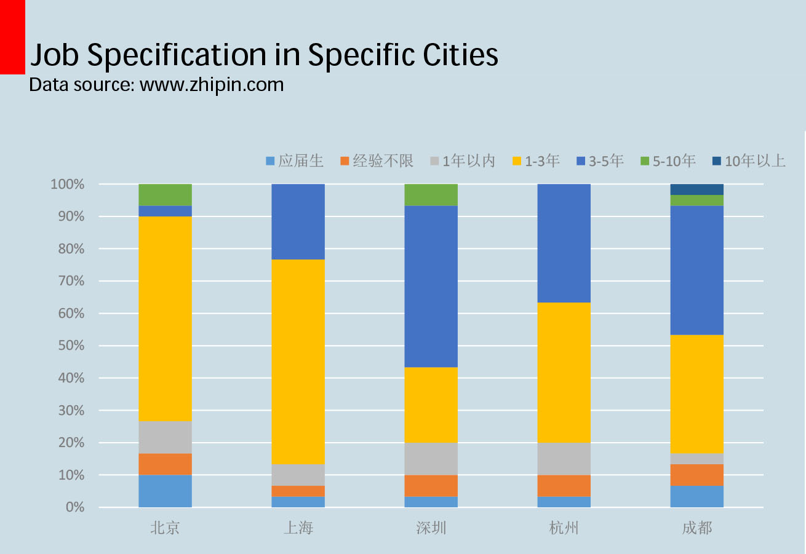

已经是 8021 年了，找工作也需要用数据来作为支撑，当然，我的决定权也是很重要滴。出于这种想法，一股来自东方的神奇力量开始了使用 Java 对 BOSS 直聘、拉钩、猎聘等网站的漫漫爬取之路。
<!--more-->
总的来说，运气还是不错的。第一个选取的网站 BOSS 直聘，相当良心，既没有像拉钩那样夸张的全用 js 动态加载工作详情，也没有像猎聘那样必须要首先注册才能使用其功能，更不像某老牌招聘网站使用gbk作为其编码格式，给我缩减了不少麻烦。

## 1. 辅助的工具
### 1.1 [HttpComponents Client](http://hc.apache.org/)
这里用到的 HttpComponents Client 是 Commons HttpClient 3.x 的后继者。
### 1.2 [MySQL-Connector-Java](https://dev.mysql.com/downloads/connector/j/) 
MySQL 的 JDBC 驱动，用于在 Java 中操作 MySQL 数据，比较遗憾的是本次爬虫的数据的处理没有实现自动化，有些可以使用 Redis 作为缓存来优化的地方也没有去实现。

## 2. 主要的逻辑
- 使用 HttpComponents Client 模拟 HTTP 请求获取 “ Java 开发” 关键字搭配不同工作城市在招聘网站的搜索结果。
- 从检索结果中拿到工作详情页面的 URL。
- 再次使用 HttpComponents Client 模拟 HTTP 请求获取工作详情的页面。
- 从爬取的工作详情界面获取工作信息并存储到 MySQL 数据库中。

## 3. 有待于实现
- 在爬取过程中，曾有因为访问频率过高遇到被封 IP 的问题，还是感觉很抱歉滴，毕竟这样对人家的服务器不友好。后来通过设置一个单线程池控制了爬取的速率，总算是平静了些。但是归根结底，最好的解决方式其实还是使用 IP 代理池。
- 这次的数据分析过程一点都不高大上，数据量有限通过 Excel 肝肝肝就可以了，但是万一数据量扩大呢，有待思考惹，拿到数据无法处理也是比较蛋疼惹。

## 4. 归一于结论

- **薪资水平上**：沪杭深的薪资水平莫名其妙的高于了帝都，北京和成都组成了第二梯队。

- **学历要求上**：京沪深人才济济，各公司对学历卡的明显也要严格一些。

- **经验要求上**：对比最能反映初级/高级水平的经验1-3年/经验3-5年，意外的发现京沪对经验这块要求竟然要宽容些。

---

总的来说， Java 开发相关工作的需求量还是很大的，本次从招聘网站获得的是检索结果第一页的 30 条信息，基本都是在 5 月发出的。从数据来看，以 Java 开发部分代表的互联网行业薪资水平确实大大超过了其它门类，体现在内地和沿海差距也不大。另外，越是发达的地区，对人才的硬件要求更高，但是对工作经验这一块却越宽容。限于数据量的问题，本次对各城市 Java 开发相关工作的比较肯定存在有与实际不符之处，比如帝都的薪资水平存疑（o(∩\_∩)o ），在以后的实验中可能需要更大的数据量作为支撑。

