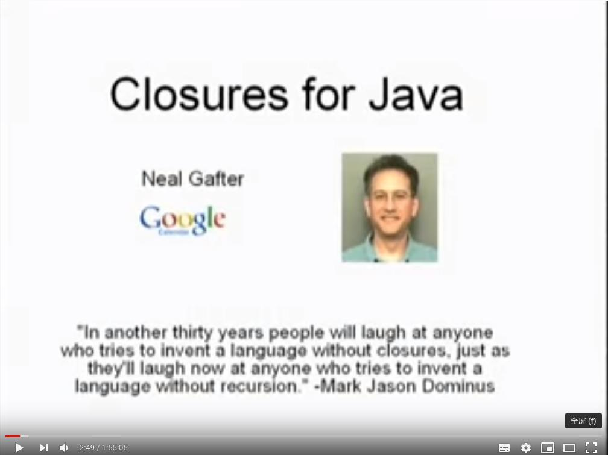

<div style="height: 50%, width: 50%"></div>

<!--more-->

## 0 Preface

When learning [CS 61A](https://inst.eecs.berkeley.edu/~cs61a/sp18/), I found some interesting points in lambda expressions and higher-order functions and their usage in different languages. However, lambda and higher-order function are fundations for what we called closures. This article is focusing on implementation of lambda and closure in different languages.

## 1 Lambda Expressions

Lambda or lamda (uppercase Λ, lowercase λ; Greek: λάμ(β)δα lám(b)da) is the 11th letter of the Greek alphabet. In computer science, we often use lowercase lambda - λ to introduce **anonymous functions**. 

### 1.1 Using Lambda

Define a function that take one argument x and return x + 1

#### 1.1.1 Python solution:

```python
# without lambda
def adder(x):
    return x + 1

# using lambda
adder = lambda x: x + 1
```

#### 1.1.2 Java solution:

```java
// without lambda
public int adder(int x) {
    return x + 1
}

//using lambda
Function<Integer, Integer> adder = x -> x + 1;
```

#### 1.1.3 JavaScript solution:

```javascript
// without lambda
function adder(x) {
	return x + 1
}
// using lambda
adder = x => x + 1
```

#### 1.1.4 Scala solution:

```scala
// without lambda
def adder1(x: Int): Int = {
    x + 1
}

// with lambda
def adder = (x: Int) => x + 1
```

### 1.2 Limitation

#### 1.2.1 Python
  - Only allow oneline expression in lambda, statements not allowed in lambda expression
  - does not create or modify any variables
  - must with `lambda` keyword

#### 1.2.2 Java

- Lambda expressions (as well as anonymous classes) in Java can only access to the final (or effectively final) variables of the enclosing scope.
- We can solve the problem easily by using wrapper object.

#### 1.2.3 Javascript & Scala

- There is almost no limitation for code in lambda in Scala and Javascript.
- Free variables can be changed.
  - In scala, variables are mutuable or immuatable depends on val/var

### 1.3 Angel or Evil

Lambdas are good, it makes first-clas functions to be passed around, and mekes it perfect with some build-in apis that accept functions as parameters. But there are some aspects that makes it evil.

- In languages that can define functions without lambda, using lambda may make logic unclear.
- Build-in lambdas are re-created.
- When higer order function add confusion

Example1:

```java
List.of(1, 2, 3).stream
  .map(x -> x)
  .collect(Collectors.toList)

List.of(1, 2, 3).stream
  .map(Function.identity)
  .collect(Collectors.toList)
```

Example2:

```java
  /**
   * 根据规则和基数计算客户积分
   * - 若积分方式为不积分，则返回不积分0
   * - 若积分方式为其他，则返回基数*倍率
   */
  private static int doCalculate(PointsRule rule, BigDecimal base) {

    Function<PointsMethod, BiFunction<BigDecimal, BigDecimal, BigDecimal>> function = method ->
        (ratio, baseAmount) -> {
          if (method == PointsMethod.None) {
            return BigDecimal.ZERO;
          } else {
            return ratio.multiply(baseAmount);
          }
        };

    // 小数部分四舍五入
    return function.apply(rule.getMethod()).apply(rule.getRatio(), base)
        .setScale(0, RoundingMode.HALF_UP)
        .intValue();
  }
```

### 1.4 Rating

Rate lambda in defferent languages, IMO.

| language | purity | functionality | simplicility |
| - |:-:|:-:|:-:|
| Python     | 5 | 1 | 4 |
| Java       | 1 | 4 | 3 |
| JavaScript | 1 | 5 | 5 |
| Scala      | 1 | 5 | 4 |

- Python‘s lambda is one-line expression, make nothing changed, so it gets highest score in purity.
- Java/JavaScript/Scala don't have the limitation, so get higher score in functionality.
- Java's variable must be labled with type, which is verbose. Scala must note the parameter type. Python lambda must labeled with `lambde`. Make them less simplier.

## 2 Closure

### 2.0 Definition



- Neal Gafter quoted this in [Advanced Topics In Programming Languages: Closures For Java](https://www.youtube.com/watch?v=0zVizaCOhME&t=3194s)

From [here](javac.info), we can see that what Neal Gafter exactly talked about is lambda, but in the talk, closure is defined explicitly:

- A closure is a function that refers to free variables in its lexical context
- A function is a block of code with parameters. It may produce a result value
- A free variables is a identifier used but not defined by the closure

Some speackers may say:

- Any data structure that binds a lexical environment is a closure,
- In JavaScript, closures are created every time a function is created, at function creation time

But since these functions were created in the global scope, they have access to all the variables in the global scope, and the closure comcept is not really relevant.

### 2.1 Using Closures

Application for closures:

- Mimic private variables in object-oriented languages
- In FP, closures are used for partial application & currying
  - Partial application means apply function to some of its arguments

Example 1: Suppose we want to count the number of times user clicked a button on a webpage.

```javascript
<button onclick="updateClickCount()">click me</button>  

var updateClickCount=(function(){
    var counter=0;

    return function(){
     ++counter;
     // do something with counter
    }
})();
```

Example2: Given a function named `add` 

```text
int, int => int
```

Now, we are going to implements a function named `curry2` to produce a function from a bi-parameter function can accept operands one by one.

#### 2.1.1 Python Solution

```python
from operator import add

def curry2(func):
    """currying add"""
    return lambda a: lambda b: func(a, b)

curried_adder = curry2(add)
print(curried_adder(2)(3))
```

#### 2.1.2 Java Solution

Java doesn't have inner methods, so code block represents closure implementd by lambda expressions. I think this is why [the closure definition in wikipedia]() says:

> The term closure is often used as a synonym for anonymous function.

```java
import java.util.function.BiFunction;
import java.util.function.Function;

public class Curry2 { 
  public static void main(String[] args) {
    BiFunction<Integer, Integer, Integer> add = Integer::sum;
    Function<Integer, Function<Integer, Integer>> curriedAdder = curry2(add);
    System.out.println(curriedAdder.apply(2).apply(3));
  }

  public static Function<Integer, Function<Integer, Integer>> curry2(BiFunction<Integer, Integer, Integer> origin) {
    return a -> b -> origin.apply(a, b);
  }
}
```

#### 2.1.3 Javascript Solution

```javascript
function curry(f) { // curry(f) does the currying transform
  return function(a) {
    return function(b) {
      return f(a, b);
    };
  };
}

// usage
function sum(a, b) {
  return a + b;
}

let curriedSum = curry(sum);
```

#### 2.1.4 Scala Solution

```scala
object curry2 {
    def apply(func: (Int, Int) => Int) = {
        a: Int => b: Int => func(a, b)
    }
}

object main extends App {
    // 1 curry2 defined by manual
    val curriedAdd1 = curry2((a: Int, b: Int) => a + b)
    assert(curriedAdd1(2)(3) == 5)

    // 2 native curry
    val func = (a: Int, b: Int) => a + b
    val curriedAdd2 = func.curried
    assert(curriedAdd2(2)(3) == 5)

    // 3 by eta expansion
    def add(a: Int)(b: Int): Int = a + b
    val curriedAdd3 = add _
    assert(curriedAdd3(2)(3) == 5)

}
```

What is eta-expansion:

> a mechanism for transforming methods into functions

### 2.2 Rating

Rate closure in defferent languages, IMO.

| language | closurer |
| - | -: |
| Python     | 4 | 
| Java       | 2 | 
| JavaScript | 4 | 
| Scala      | 5 | 

- Closurer means which is more closure
- Java doesn't have inner method, make it lowest score. While scala does something on compile level for FP features, making it highest score.

## Reference

- [CS 61A Lab 2: Lambda Expressions and Higher-Order Functions](https://inst.eecs.berkeley.edu/~cs61a/sp18/lab/lab02/)
- [OpenJDK - Project lambda](openjdk.java.net/projects/lambda)
- [JSR 335 - Lambda Expression for the Java Programming Language](jcp.org/en/jsr/detail?id=335)
- [Advanced Topics In Programming Languages Closures For Java](https://www.youtube.com/watch?v=0zVizaCOhME)
- [What is a practical use for a closure in javascript](https://stackoverflow.com/questions/2728278/what-is-a-practical-use-for-a-closure-in-javascript/39045098#39045098)
- [Methods as functions (or, what exactly is “eta expansion”?)](https://medium.com/@sinisalouc/on-method-invocations-or-what-exactly-is-eta-expansion-1019b37e010c)
- [JavaScript Scope and Closures](https://wsvincent.com/javascript-scope-closures/)
- [Overusing lambda expressions in Python](https://treyhunner.com/2018/09/stop-writing-lambda-expressions/)

