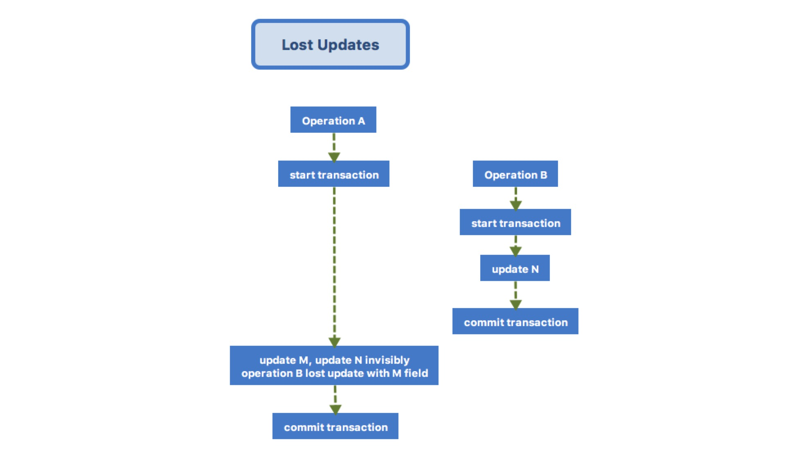

不久前，在编码系统某业务模块完毕，感觉万事大吉可以放飞自我的时候，测试出一个莫名其妙的 BUG。

<!--more-->

## 一次事故

远离代码细节，从表面上来看，引起这个 BUG 的操作是这样的：

- 用户进行 A 操作（后含异步操作），该操作会更新某表 M 字段的值 MValue0 为 MValue1
- 用户进行 B 操作（简单同步操作），该操作会更新该表 N 字段的值 NValue0 为 NValue1

流程设计中，A（含后续异步操作）、B 操作是可以并行或者不并行的，取决于用户在两个操作之间间隔的时间，而且他们之间并不会相互影响。但是在测试中，如果 B 操作 并行于 A，时常会出现一个奇怪的现象：

- A、B 操作结束后, N 字段的值仍然为 NValue0 ，仿佛没有受到操作 B 影响似的。

可以推断出，A 操作虽然只想更新 M 字段值，但是一定触碰到了 N 字段值，并对其进行更新。有经验的程序员可能会立马从脑海中蹦出“丢失更新” (Lost Updates) 这个词儿，并且浮现出下面这张传统的丢失更新复现图作为佐证：

但是知道了这个问题属于丢失更新范畴并没有让我们能够解决这个问题。针对此次丢失更新，有一些隐蔽的细节：

- 此类丢失更新不受隔离级别控制，是不可避免的 ：
> Another potential problem can occur when two processes read the same row and then update that data with different values. This might happen if a transaction first reads a value into a variable and then uses the variable in an update statement in a later step. When this update executes, another transaction updates the same data. Whichever of these transactions is committed first becomes a lost update because it was replaced by the update in the other transaction. You cannot use isolation levels to change this behavior, but you can write an application that specifically allows lost updates.
摘自 [Developing SQL Databases (p. 212)](http://www.doc88.com/p-9092839996451.html)
参考 [Minimum transaction isolation level to avoid “Lost Updates”](https://stackoverflow.com/questions/8201430/minimum-transaction-isolation-level-to-avoid-lost-updates)

- 此次丢失更新并不是系统代码有意为之。A 操作的目的只是更新 M 字段的值，但是却莫名触发了 N 字段值的还原。
- 简单的 select 语句不会给所读取的数据行上锁。

## 两轮辗转

问题最终回到了系统使用的技术架构上。搭乘 Spring Boot 的春风，Spring Data JPA 被用来作为数据库访问的框架，就底层来说，其实使用的是 Hibernate。使用过程中，我们享受了其带来的查找、更新、保存等各个方面的便利，但是这次它却带来了一些意料之外的“惊喜”。

具体到代码中，Spring Data JPA XXRepository 的 save 方法被用来更新数据库字段，由于 save 方法针对的是一个实体（Entity）及其子对象（更严谨的说应该是当前 session 管理下的所有实体），这种机制下自动生成的 SQL update 语句也如实地更新了该实体类中的所有字段。具体流程见下图：

上图还原了此次事故发生的全过程。操作 A 所含事务跨度较大，包含了操作 B 所含事务，且操作 A 读取的数据是操作 B 更新前的旧数据，等到 A 操作真正去执行更新操作时，将旧值写入 update 语句覆盖了 B 操作的更新。为了解决这个问题，使得自动生成的更新语句仅包含当前操作中更新了的字段，我们找到了 Hibernate **dynamic-update** 属性。[官方文档](http://docs.jboss.org/hibernate/core/3.3/reference/en/html/mapping.html#mapping-declaration-class)中对这个参数的解释是：

> dynamic-update (optional - defaults to false): specifies that UPDATE SQL should be generated at runtime and can contain only those columns whose values have changed.

但是很快开启 Dynamic Update 的问题也被揭示出来，考虑这么一种情况：

两个一前一后的相同操作，仅仅因为有部分时序上的重叠（相当于是用户短时内多次发起请求），就造成了结果错误，没有如实地记录第二次更新操作的结果，这也是在生产中不允许出现的。

## 三点想法

至此，使用 ORM 框架来进行数据库字段更新的道路似乎已经走到了尽头，无论是使用默认的字段全量更新，还是开启动态更新，都会在某些情况下出现意料之外的事情，造成难以排查的 BUG。我们应该看到，ORM(Object Relational Mapping) 框架及其所属的 OOP(Object Oriented Programming) 体系存在一些固有的缺陷，并不值得我们在系统建设中视其为金科铁律，一以贯之。

1.[ORM 是软件工程界的“越战”](http://blogs.tedneward.com/post/the-vietnam-of-computer-science/?from=timeline) By Ted Neward

- 越战给美国带来的最大的教训是：To know when to “cut bait and run”；亦即中国古语所云：识时务者为俊杰；亦如股市圣经：及时止损。
- 软件工程师们在 ORM 道路上犯的最大错误和美国在越战上犯的错误一样：这一领域实在是太吸引人，大家都笃定认为这条道路没有错，花费巨大的精力在这一领域攻克难关。最终的结果是巨大的投入，却得到了不甚完美的 ORM 解决方案。

2.[OOP 是拿着香蕉的大猩猩](https://www.johndcook.com/blog/2011/07/19/you-wanted-banana/) By Joe Armstrong

- 在这次事故的例子中，“大猩猩”如影随形。
- 当未使用动态更新时，我们面对的是一个傻乎乎的“大猩猩”，它盲目、笨拙地去更新了数据库表的所有字段，在某些情形下，费力不讨好，由于更新了本不应该更新的字段，导致出现错误；
- 当配置了动态更新之后，我们面对的是一个无比强悍的大猩猩，它能精确识别字段的更改，动态地去生成仅包含需要更新字段的 SQL update 语句，但是它的这种能力来自于设计师的某种假设——字段变更的判断是根据与 ORM 缓存比较得来的结果，具有先天的局限性，很容易被缓存欺骗。同时，这样的比较也给系统带来了额外的负担，动态生成的 SQL 语句也不如事先编译好的语句用起来简单和方便。
- 大猩猩的存在一定程度上方便了香蕉获取，但是既给系统运行带来额外负担，又留下了可能产生 BUG 的坑。在有一定能力的情况下，拒绝大猩猩是一个明智、经济之选择。

3.想你所想，做你应做 By me

- 完成一项任务，应该准确地完成该项任务描述中的内容，干净利落，不依赖任何其它机制的副作用来完成这件事，也不能因为完成这件事给系统带去任何副作用。恰如时节好雨，春日发生，随风潜入夜，润物细无声。OOP 的思想显然与这样的要求南辕北辙，它在实现某项功能的过程中，管理了过多当前功能要求之外的实体，依赖了过多当前功能要求之外的状态，隐藏了过多实现上的细节。

PS:

- Ted Neward: auther of Effective Enterprise Java, C# In a Nutshell
- Joe Armstrong: creator of Erlang
- Me: no one