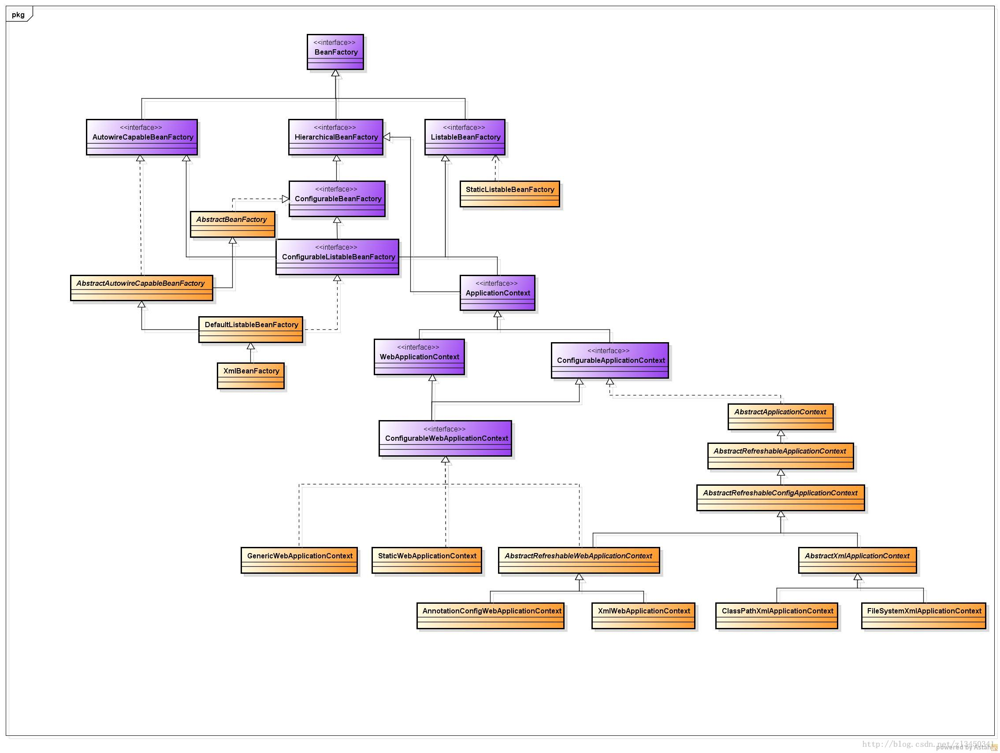
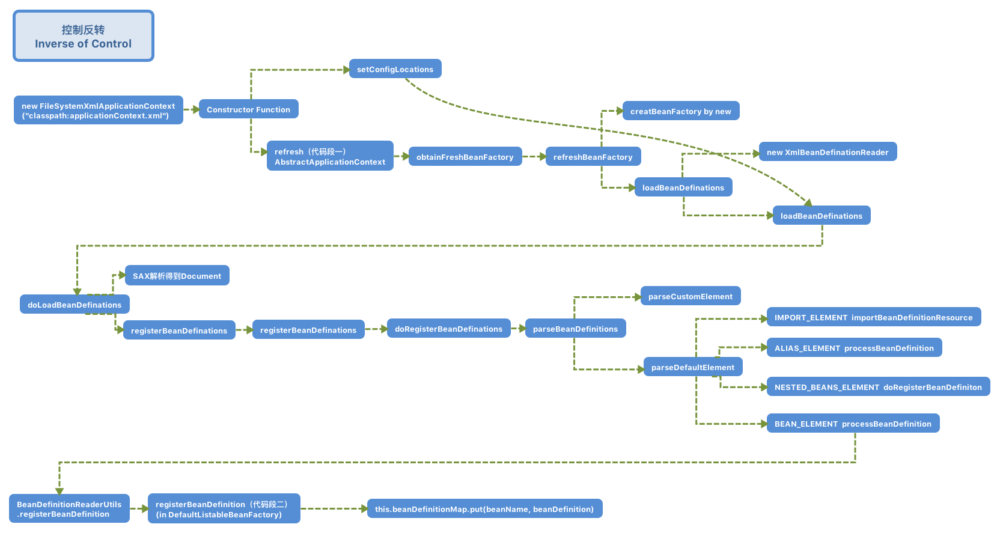
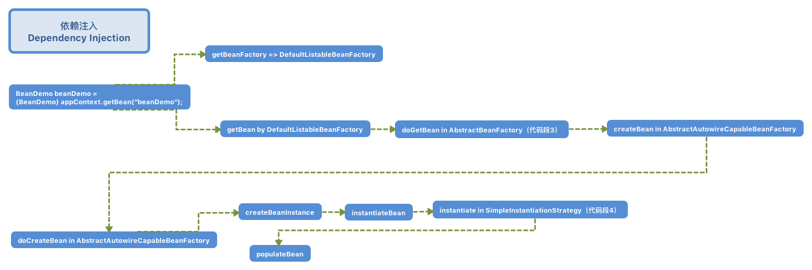

Bean 的管理是 Sping 框架中的核心内容。在 Spring 中，Bean 被抽象为 BeanDefinition 这种数据结构，其定义完整描述了我们在配置文件中定义的 \<bean> 节点中的所有信息，包括各种属性、各种类型的子节点。Spring 对 Bean 的管理就是围绕 BeanDefination 来展开的。根据 Bean 来源的不同，Spring 的启动围绕各种定义了 Bean 的资源文件、注解去展开。本文从最基础的形式开始，主要讲述基于 XML 配置文件的 Spring IOC 容器的启动流程。

<!--more-->

## 1 Spring 框架继承关系



Spring 框架结构层次设计精巧，比较复杂，直接切入代码去可能会造成只见树木，不见森林，所以必须要对 Spirng 的框架先有一个宏观了解。上面的继承关系图具体来源见图片水印，有空我会自己画画将其替换。

BeanFactory 是 Spring 框架中最核心的老祖宗接口，定义了 Bean 管理的最高抽象，其每个子接口都是对 BeanFactory 在某些特定需求方面的扩充。

- HierarchicalBeanFactory 定义了获取父工厂和判断当前工厂是否拥有某个 Bean 对的方法
- AutoWireCapableBeanFactory 用于赋予未纳入 Spring IOC 容器管理的 Bean 和 Spring 容器管理的 Bean 一样的自动装配的功能（如 Servlet）
- ListableBeanFactory 用于赋予其实现类遍历访问其管理的 Bean 的实例的功能
- ConfigurableBeanFactory 则在 BeanFactory 接口之外定义了更多对 Bean Factory 进行配置的方法
- ConfigurableListableBeanFactory 定义了分析和修改 Bean Definition 和提前实例化单例 Bean(preInstantiateSingletons) 的方法

基于这些接口，Spring 定义了不同抽象层次、不同用途的 BeanFactory 抽象类和类。

- AbstractBeanFactory 是大部分 BeanFactory 实现类的抽象基类，实现了诸如 getBean 等 BeanFactory 的基础方法
- AbstractAutowireCapableBeanFactory 在 AbstractBeanFactory 抽象类的基础上加入了 AutoWireCapableBeanFactory 接口中定义的功能
- **DefaultListableBeanFactory** 是一个 Bean Factory 的完整（full-fledged）实现，其典型的使用方法是：
  - 在使用 Bean 之前，首先注册所有的 BeanDefinition 作为 Bean 的元数据，使得 Bean 的查找和获取过程中的资源消耗得以降低
- XmlBeanFactory 是 DefaultListableBeanFactory 的简易扩展，内置了一个 XmlBeanDefineReader 用于解析 XML 文档

ApplicationContext 是 Spring 当前体系下和 BeanFactory 同等重要的接口，由于一些拓展性上的原因，ApplicationContext 接口家族是 Spring IOC 容器使用的推荐体系，而直接使用 BeanFactory 家族实现类的做法基本被废弃。ApplicationContext 接口继承了 BeanFactory 家族中定义的对于 Bean 管理的所有功能，同时增加了以下功能：

- 继承自 ResourceLoader 接口的以一种通用形式加载资源文件的功能
- 继承自 ApplicationEventPublisher 接口的向注册的 Listener 发布事件的功能
- 继承自 MessageSource 的支持国际化的功能

ApplicationContext 接口下也有不同层次的接口和抽象类，本文围绕的是 FileSystemApplicationContext 这个通过指定文件路径读取 xml 文档来初始化容器的实现类展开的，关于 ApplicationContext 的层次会在下文中部分提及。

## 2 示例代码

```java
/**
 * @author LangInteger@outlook.com
 * @date 2018/8/28 0:52
 */
public class Spring {
    public static void main(String[] args) {
        FileSystemXmlApplicationContext appContext =
                new FileSystemXmlApplicationContext("classpath:applicationContext.xml");
        BeanDemo beanDemo = (BeanDemo) appContext.getBean("beanDemo");
        beanDemo.doSomething();
    }
}
```

上面的三行代码，如三行情诗一般凝练，也确实表达出了如同三行情诗一般丰富的感情，如果想捅破那层窗户纸，让情感来的更加露骨和真切，不妨试试下面这段编程式使用 IOC 容器的代码，可以更深入地了解作者的心路历程和 IOC 容器的启动流程。

```java
public class DemoBeanTest {

  @Test
  public void testXml1() {
    ClassPathResource resource = new ClassPathResource("applicationContext.xml");
    DefaultListableBeanFactory factory = new DefaultListableBeanFactory();
    XmlBeanDefinitionReader reader = new XmlBeanDefinitionReader(factory);
    reader.loadBeanDefinitions(resource);

    DemoBean bean = (DemoBean) factory.getBean("demoBean");
    bean.doSomthing();

  }
}
```

可以看到，第二段代码绕开了 BeanFactory/ApplicationContext 的具体实现子类，通过代码显示地使用了 DefaultListableBeanFactory 和 XmlBeanDefineReader 来完成了容器初始化的功能。
这也正是 Spring 框架设计的精巧之处，通过模块化使得用户得以灵活地介入到 IOC 容器初始化的流程当中，并赋予了用户对某个模块进行扩展的权利，自定义地去实现最适合用户的 IOC 容器初始化流程。

## 3 控制反转-流程分析

Spring 容器启动的过程主要有：

- 使用 ResourceLoader 来对 BeanDefinition 所属资源文件进行的定位
- 使用 BeanDefinitionReader 来载入 BeanDefiniton
- 使用 BeanDefinitionRegistry 来注册 BeanDefinition

围绕一次完整的 FileSystemXmlApplicationContext 的实例化流程的方法调用，可以得到不甚明了的如下流程图。你问我是不是下图中的每一行就代表了上面的每一个步骤，我可以约摸着告诉你是的。



## 4. 控制反转-代码分析

### 代码段一：refresh in AbstractApplicationContext

AbstractApplicationContext 是所有 ApplicationContext 实现类的顶层抽象类，具体描述了适用于所有 ApplicationContext 的公用方法。如本节所附代码段一所示的 refresh 方法，是启动整个 IOC 容器的方法。代码简明扼要，叙述了启动流程中要做的每项事情，只要洞悉了这其中的每一个方法，也就算是摸透了 Spring IOC 容器的启动流程。在此对其中的每个方法进行说明：

1. prepareRefresh：设置 Spring 容器的初始化参数
2. obtainFreshBeanFactory：
3. prepareBeanFactory：获取 BeanFactory 并进行相关设置，如添加 ApplicationContextAwareProcessor 这个 BeanPostProcessor
4. postProcessBeanFactory：执行不同实现子类定义的对 BeanFactory 的后操作
5. invokeBeanFactoryPostProcessors：找出实现了BeanFactoryPostProcessor接口的processor并执行
6. registerBeanPostProcessors：找出实现了 BeanPostProcessor 接口的 Bean，并设置到 BeanFactory 的属性当中去。
7. initMessageSource：添加国际化相关的属性
8. initApplicationEventMulticaster：初始化事件广播器
9. onRefresh：留给实现子类自由发挥的一个模版方法，用于实例化一些必要的对象
10. registerListeners：注册事件广播器的 listener
11. finishBeanFactoryInitialization：实例化所有已注册但是还未实例化的非懒加载单例 Bean
12. finishRefresh：杂活儿

```java
@Override
public void refresh() throws BeansException, IllegalStateException {
  synchronized (this.startupShutdownMonitor) {
    // Prepare this context for refreshing.
    prepareRefresh();

    // Tell the subclass to refresh the internal bean factory.
    ConfigurableListableBeanFactory beanFactory = obtainFreshBeanFactory();

    // Prepare the bean factory for use in this context.
    prepareBeanFactory(beanFactory);

    try {
      // Allows post-processing of the bean factory in context subclasses.
      postProcessBeanFactory(beanFactory);

      // Invoke factory processors registered as beans in the context.
      invokeBeanFactoryPostProcessors(beanFactory);

      // Register bean processors that intercept bean creation.
      registerBeanPostProcessors(beanFactory);

      // Initialize message source for this context.
      initMessageSource();

      // Initialize event multicaster for this context.
      initApplicationEventMulticaster();

      // Initialize other special beans in specific context subclasses.
      onRefresh();

      // Check for listener beans and register them.
      registerListeners();
      // Instantiate all remaining (non-lazy-init) singletons.
      finishBeanFactoryInitialization(beanFactory);
      // Last step: publish corresponding event.
      finishRefresh();
    }
    catch (BeansException ex) {
      // 省略异常处理的代码
    }
    finally {
      // Reset common introspection caches in Spring's core, since we
      // might not ever need metadata for singleton beans anymore...
      resetCommonCaches();
    }
  }
}
```

### 代码段二：registerBeanDefinition in DefaultListableBeanFactory

注册 BeanDefinition 的过程，是由 DefaultListaableBeanFactory 提供的方法进行的，这也是顺理成章的事情。之前有提到，ApplicationContext 家族是在 BeanFactory 家族的基础上加入了一些高级 IOC 容器的特性，但是关于 Bean 核心管理却并未做更改，大部分 ApplicationContext 的实现类都内置了 DefaultListableFactory 来进行 Bean 的管理。
通过如下代码可以看到，从 xml 配置文件中读取的所有的 BeanDefinition 被存储在了一个 ConcurrentHashMap数据结构中，key 为 beanName，value 为 BeanDefinition 对象；同时还把所有的 beanName 存储在 ArrayList 数据结构中。
至此，Spring IOC 容器的初始化过程便基本完成。在这个过程中，严格来讲是不包括依赖注入（Dependency Inject, DI）的，这里仅仅完成了 Bean 定义的载入，而依赖注入发生于向 IOC 容器索取某个 Bean 时。但是在代码段一中阐述了一个例外：单例的非懒加载 Bean 会在 refresh 方法中 通过调用 finishBeanFactoryInitialization 实现预实例化，

```java

  // Implementation of BeanDefinitionRegistry interface
  //---------------------------------------------------------------------

  @Override
  public void registerBeanDefinition(String beanName, BeanDefinition beanDefinition)
      throws BeanDefinitionStoreException {

    //省略一些检查
    BeanDefinition oldBeanDefinition;
    oldBeanDefinition = this.beanDefinitionMap.get(beanName);
    //省略日志打印
    //若存在重复的 Bean 定义，后面的会覆盖前面的
    this.beanDefinitionMap.put(beanName, beanDefinition);
    }
    else {
      if (hasBeanCreationStarted()) {
        // Cannot modify startup-time collection elements anymore (for stable iteration)
        synchronized (this.beanDefinitionMap) {
          this.beanDefinitionMap.put(beanName, beanDefinition);
          List<String> updatedDefinitions = new ArrayList<>(this.beanDefinitionNames.size() + 1);
          updatedDefinitions.addAll(this.beanDefinitionNames);
          updatedDefinitions.add(beanName);
          this.beanDefinitionNames = updatedDefinitions;
          if (this.manualSingletonNames.contains(beanName)) {
            Set<String> updatedSingletons = new LinkedHashSet<>(this.manualSingletonNames);
            updatedSingletons.remove(beanName);
            this.manualSingletonNames = updatedSingletons;
          }
        }
      }
      else {
        // Still in startup registration phase
        this.beanDefinitionMap.put(beanName, beanDefinition);
        this.beanDefinitionNames.add(beanName);
        this.manualSingletonNames.remove(beanName);
      }
      this.frozenBeanDefinitionNames = null;
    }

    if (oldBeanDefinition != null || containsSingleton(beanName)) {
      resetBeanDefinition(beanName);
    }
  }
```

## 5 概念阐释

基于上面的过程分析，笔者就一些常见概念进行片面的、带特定场景的、主观性的解释。

### 控制反转：

在当前例子下，控制反转就是将 xml 文件中定义的 bean 加载到 DefaultListableBeanFactory 中名为 beanDefinationMap的ConcurrentHashmap<String, BeanDefinition> 数据结构中去。
当然有朋友可能觉得这不够，认为依赖注入应该是归属于控制反转的，因为只有当获取到 Bean 实例之后整个控制反转流程才算完成，而获取实例的过程中往往就会发生依赖注入。笔者认为这是仁者见仁、智者见智的事情，因为注册 BeanDefinition 之后其实 IOC 容器已经拥有了一种非显示实例化（如 new） Bean 的能力，依赖注入更像是锦上添花的事情。无论这两种定义你喜欢那种，笔者认为都是可以接受的。

### IOC 容器

往大了说，是 FileSystemApplicationCOntext，往中了说，是 DefaultListableBeanFactory，往小了说，就是 ConcurrentHashmap<String, BeanDefinition>  beanDefinationMap。
当然，我们不能钻牛角尖，和别人争论说 IOC 容器就仅仅是 ConcurrentHashmap，因为只给你一个 CocurrentHashMap 是无法实现 Bean 管理的功能的，IOC 容器还需要搭配各种操作来丰富这个单纯的数据结构的内涵，达到管理 Bean 的目的。

## 6 依赖注入-流程分析

本来作为将控制反转和依赖注入严格区分的笔者是没想在这里讲依赖注入的流程分析的，但由于标题取的是 Spring IOC 容器的启动流程分析，而单例的非懒加载 Bean 是我们经常会创建的，恰好会在启动过程中被预实例化。单例非懒加载 Bean 预实例化的过程和 getBean() 这个方法的中间流程有很多相似之处，索性就在这里将 getBean 方法的流程顺带分析一下。小节标题取为“依赖注入-流程分析”有其不严谨之处，因为依赖注入仅仅是 getBean() 方法执行过程中会涉及到的一个点，或者说 getBean() 会触发依赖注入，取为“ Bean 实例化-流程分析”可能更加严谨，但是不好看，不整齐，无它。
主要的 Bean 实例化流程图如下：



看完之后你可能会发出一声“哇擦哦”的感叹，因为流程图直到“populateBean”就戛然而止了，这是 getBean 中的最后一个流程，也是依赖注入核心代码实现所在。里面情况太多，以后开个专门的专题来讲解。

## 7. 依赖注入-代码分析

### 代码段三：doGetBean in AbstractBeanFactory

doGetBean 从 Bean 的作用范围上对需要实例化的 Bean 进行了区分，分为 singleton、prototype、其他的自定义 scope 等情况。

```java
  /**
   * Return an instance, which may be shared or independent, of the specified bean.
   * @param name the name of the bean to retrieve
   * @param requiredType the required type of the bean to retrieve
   * @param args arguments to use when creating a bean instance using explicit arguments
   * (only applied when creating a new instance as opposed to retrieving an existing one)
   * @param typeCheckOnly whether the instance is obtained for a type check,
   * not for actual use
   * @return an instance of the bean
   * @throws BeansException if the bean could not be created
   */
  @SuppressWarnings("unchecked")
  protected <T> T doGetBean(final String name, @Nullable final Class<T> requiredType,
      @Nullable final Object[] args, boolean typeCheckOnly) throws BeansException {

    final String beanName = transformedBeanName(name);
    Object bean;

    // Eagerly check singleton cache for manually registered singletons.
    Object sharedInstance = getSingleton(beanName);
    if (sharedInstance != null && args == null) {
      // return cached singleton instance
    }

    else {
      //some check

      try {
        final RootBeanDefinition mbd = getMergedLocalBeanDefinition(beanName);
        checkMergedBeanDefinition(mbd, beanName, args);

        // Guarantee initialization of beans that the current bean depends on.
        String[] dependsOn = mbd.getDependsOn();
        if (dependsOn != null) {
          for (String dep : dependsOn) {
            if (isDependent(beanName, dep)) {
              throw new BeanCreationException(mbd.getResourceDescription(), beanName,
                  "Circular depends-on relationship between '" + beanName + "' and '" + dep + "'");
            }
            registerDependentBean(dep, beanName);
            getBean(dep);
          }
        }

        // Create bean instance.
        if (mbd.isSingleton()) {
          //create singleton bean
        }

        else if (mbd.isPrototype()) {
          //create prototype bean
        }

        else {
          //create custom_defined scope bean
        }
      }
      catch (BeansException ex) {
        cleanupAfterBeanCreationFailure(beanName);
        throw ex;
      }
    }

    //some check
    return (T) bean;
  }
```

### 代码段四：instantiate in SimpleInstantiationStrategy

spring 内置了两种实例化对象的工具，一种是 BeanUtils，一种是 CGLIB，暂时还没搞明白他们分别适用的场景，嘿嘿嘿。

```java
@Override
public Object instantiate(RootBeanDefinition bd, @Nullable String beanName,BeanFactory owner) {
  // Don't override the class with CGLIB if no overrides.
  if (bd.getMethodOverrides().isEmpty()) {
    Constructor<?> constructorToUse;
    synchronized (bd.constructorArgumentLock) {
      constructorToUse = (Constructor<?>) bd.resolvedConstructorOrFactoryMethod;
      if (constructorToUse == null) {
        final Class<?> clazz = bd.getBeanClass();
        if (clazz.isInterface()) {
          throw new BeanInstantiationException(clazz, "Specified class is an interface");
        }
        try {
          if (System.getSecurityManager() != null) {
            constructorToUse = AccessController.doPrivileged(
                (PrivilegedExceptionAction<Constructor<?>>) () ->
                    clazz.getDeclaredConstructor());
          }
          else {
            constructorToUse =  clazz.getDeclaredConstructor();
          }
          bd.resolvedConstructorOrFactoryMethod = constructorToUse;
        }
        catch (Throwable ex) {
          throw new BeanInstantiationException(clazz, "No default constructor found", ex);
        }
      }
    }
    return BeanUtils.instantiateClass(constructorToUse);
  }
  else {
    // Must generate CGLIB subclass.
    return instantiateWithMethodInjection(bd, beanName, owner);
  }
}
```

## 8. 控制反转 in Spring MVC

写这一部分是着眼于实际应用，因为大概率情况下我们是不会采用 new 的方式来获取 Spring IOC 容器的，在 java web 项目中我们也从未见过 IOC 容器被 new 出来过，下面主要分析传统的基于 xml 配置文件的采用了 Spring mvc 的 web 项目中根 IOC 容器的创建过程。

### 主要过程

1. 在 web.xml 配置文件中定义一个 DispatcherServlet，和一个 ContextLoaderListener，其中 ContextLoaderListener 是实现 web 项目中根 IOC 容器创建的监听器。

2. ContextLoaderListener 实现自 ServletContextListener，重写了 contextInitialized 方法，当 ServletContext 初始化的时候，会回调此方法

```java
/**
 * Initialize the root web application context.
 */
@Override
public void contextInitialized(ServletContextEvent event) {
  initWebApplicationContext(event.getServletContext());
}
```

3. 调用 ContextLoaderListener 基类 ContextLoader 的 initWebApplicationContext 方法，

```java
  public WebApplicationContext initWebApplicationContext(ServletContext servletContext) {

    //some check and log

    try {
      // Store context in local instance variable, to guarantee that
      // it is available on ServletContext shutdown.
      if (this.context == null) {
        this.context = createWebApplicationContext(servletContext);
      }
      if (this.context instanceof ConfigurableWebApplicationContext) {
        ConfigurableWebApplicationContext cwac = (ConfigurableWebApplicationContext) this.context;
        if (!cwac.isActive()) {
          // The context has not yet been refreshed -> provide services such as
          // setting the parent context, setting the application context id, etc
          if (cwac.getParent() == null) {
            // The context instance was injected without an explicit parent ->
            // determine parent for root web application context, if any.
            ApplicationContext parent = loadParentContext(servletContext);
            cwac.setParent(parent);
          }
          configureAndRefreshWebApplicationContext(cwac, servletContext);
        }
      }
      servletContext.setAttribute(WebApplicationContext.ROOT_WEB_APPLICATION_CONTEXT_ATTRIBUTE, this.context);

      //some check and log and catch

      return this.context;
    }
  }
```

- initWebApplicationContext 中主要做了三个事情
  - createWebApplicationContext：根据配置文件通过反射创建指定的 WebApplicationContext 实现类容器，默认情况下会实例化一个 XmlWebApplicationContext
  >  Looks for a {@link #CONTEXT_CLASS_PARAM "contextClass"} parameter at the {@code web.xml} context-param level to specify the context class type, falling back to {@link org.springframework.web.context.support.XmlWebApplicationContext} if not found. With the default ContextLoader implementation, any context class specified needs to implement the {@link ConfigurableWebApplicationContext} interface.
  - configureAndRefreshWebApplicationContext
    - 其中的核心方法为 调用 ConfigurableApplicationContex 中的 refresh 方法，由此对接到了 DefaultListableFactory 创建的一系列流程，具体的过程请参看代码段一的内容
  - 将创建的 webApplicationContext 根上下文存储到 ServletContext 中去，
    - 采用 setAttribute 的方式，key 为 WebApplicationContext.class.getName() + ".ROOT"
    - servletContext.setAttribute(WebApplicationContext.ROOT_WEB_APPLICATION_CONTEXT_ATTRIBUTE, this.context);

### 留待扩展

这里笔者提到由 ContextLoaderListener 创建的是根 IOC 容器，它以设置为属性的方式被绑定到了 ServletContext 上。既然有根 IOC 容器，自然就会有下属的 IOC 容器，在 DispatcherServlet 初始化过程中会 初始化另一个 IOC 容器，用来管理 Controller 部分的 Bean，不过还涉及到对 Spring MVC 控制转发流程的深入分析，留待下回分解了。 
