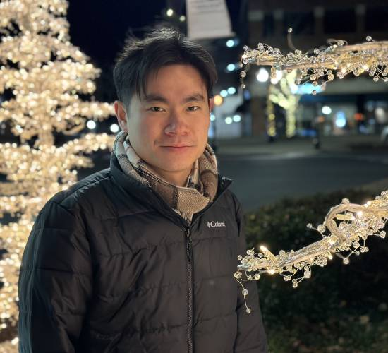

<body style="text-align: left; font-family: Times New Roman, Times, serif">
</body>

# Lang Liu

**Ph.D. Student** [ [CV](./cv.pdf) ]
**Computer Science Department**
**Illinois Institute of Technology**

Address: 004 Stuart Building, 10 W 31st Street,
Illinois Institute of Technology, Chicago, IL 60616
Email: lliu94@hawk.iit.edu

## About

Greatings! My name is Lang Liu.

I am a Ph.D. student in Computer Science at Illinois Institute of Techonology. My advisor is Professor [Farzaneh Derakhshan](http://gauss.cs.iit.edu/~fderakhshan/). My research interests are in formal methods and use the technique to ensure the safety and security of concurrent programs.

## Publications

- Upcoming

## Teaching

- Teaching Assistant: Spring 2024, CS536 Science of Programming, IIT
- Teaching Assistant: Fall 2023, [CS351 System Programming](https://mseryn.com/teaching/cs351/), IIT
